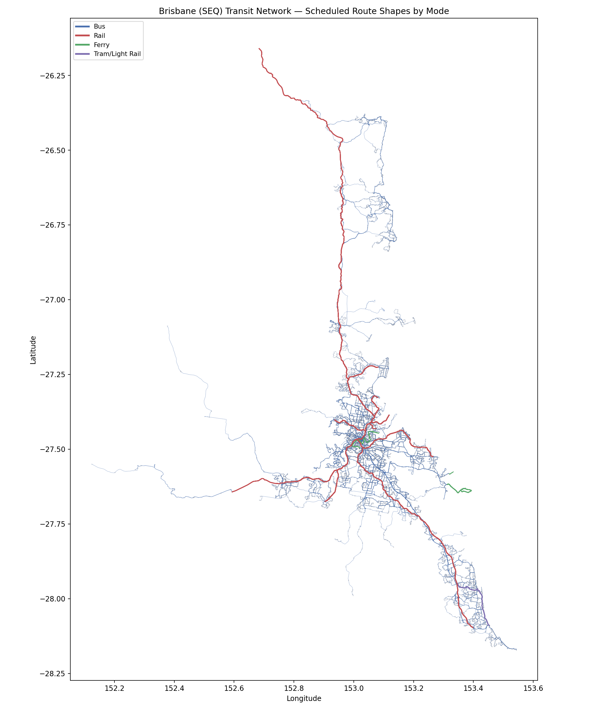
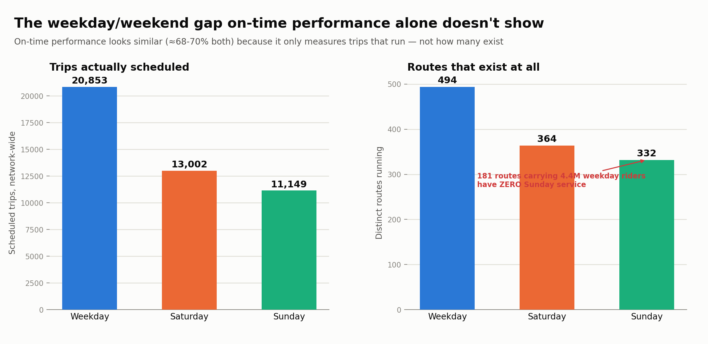
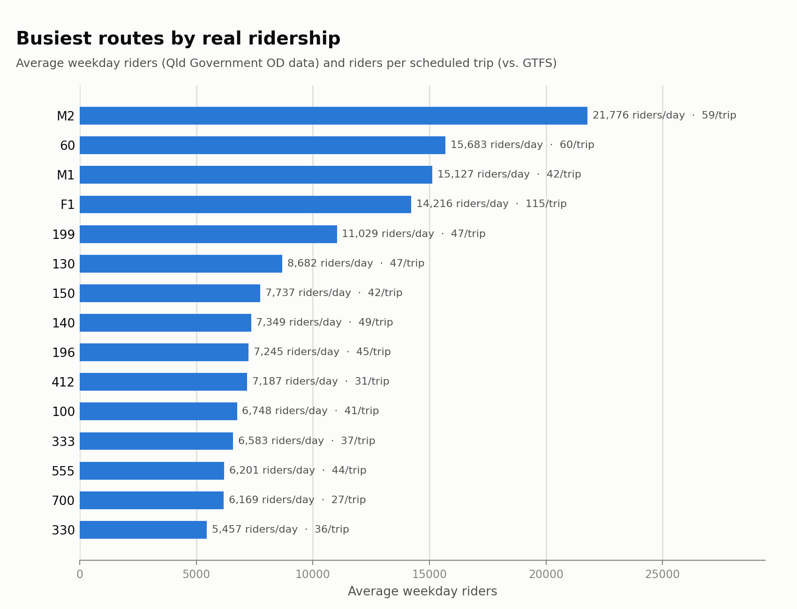
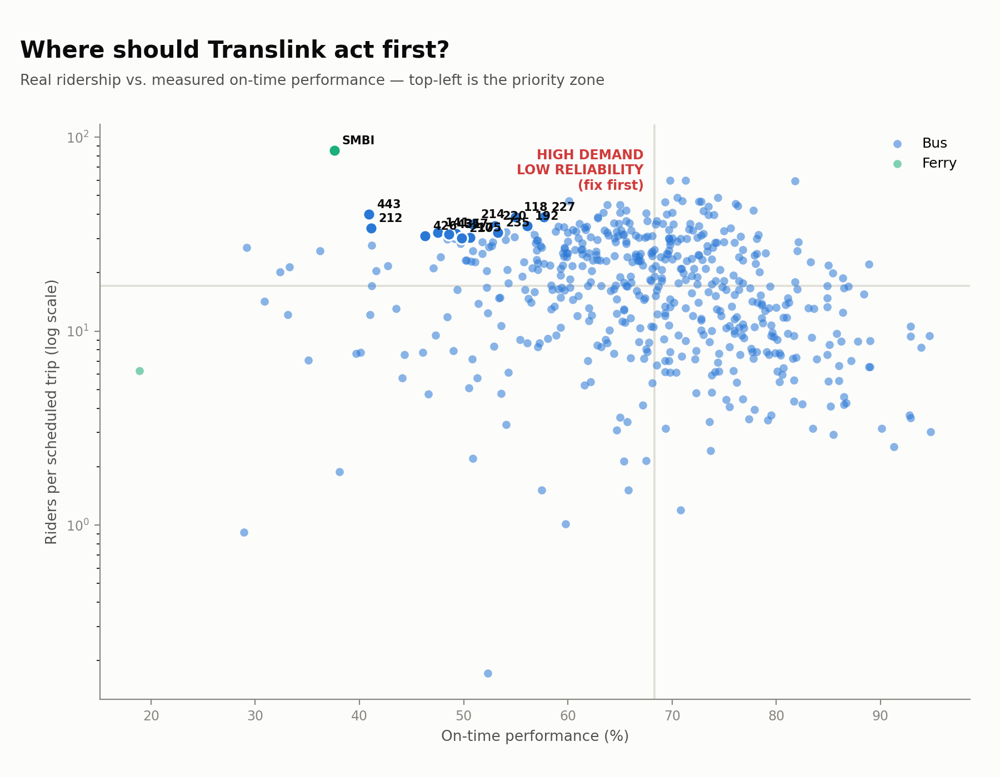
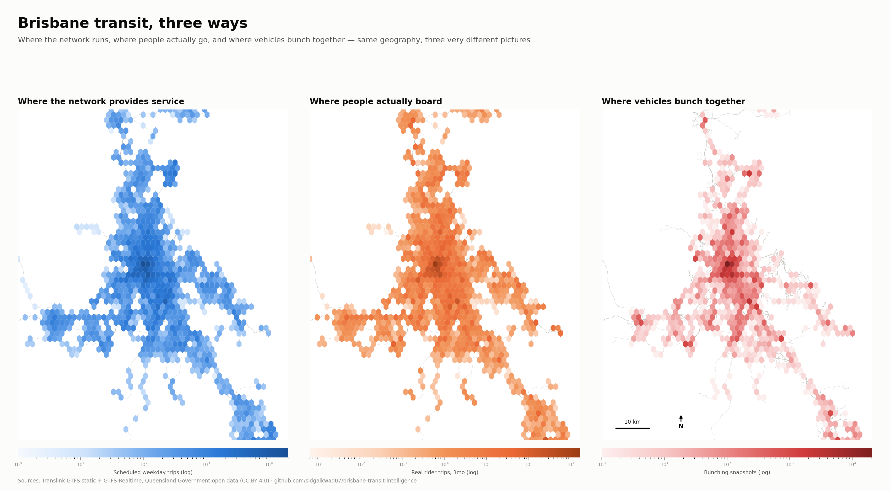

# Brisbane Transit Intelligence

A data engineering + ML project that turns Brisbane's public transport open data
(GTFS static + GTFS-Realtime, Council traffic sensors, weather) into a working
pipeline that measures network reliability, predicts delays, and surfaces where
the network is under strain.

Built as a portfolio project — the emphasis is on a real, reproducible pipeline
over a large feature set: local Postgres/PostGIS, scheduled ingestion, dbt
transformations, a trained delay-prediction model, and a dashboard, all runnable
with `docker compose up`.

## Why this project

Brisbane's transit agency (Translink) and Brisbane City Council publish open,
unauthenticated data feeds — a static GTFS schedule, a live GTFS-Realtime feed
(vehicle positions + trip updates + service alerts), and live traffic sensor
data at signalised intersections. This project ingests all three, models them
together, and asks a concrete question:

> **Where and when does Brisbane's bus network become unreliable, and how much
> of that is explained by road congestion vs. schedule design?**

## Status

This is under active development. See [`ROADMAP.md`](ROADMAP.md) for the
build plan and current progress.

## Architecture

```text
                    ┌─────────────────────┐
                    │  Translink GTFS      │  static schedule (zip, daily)
                    │  (SEQ_GTFS.zip)      │
                    └──────────┬───────────┘
                               │
                    ┌─────────────────────┐
                    │  Translink GTFS-RT   │  vehicle positions, trip updates,
                    │  (protobuf, polled)  │  service alerts (polled every ~20s)
                    └──────────┬───────────┘
                               │
                    ┌─────────────────────┐
                    │  BCC Traffic API     │  intersection volume/occupancy
                    │  (Opendatasoft REST) │
                    └──────────┬───────────┘
                               │
                               ▼
                    ┌─────────────────────┐
                    │  ingestion/*.py      │  Python, scheduled via cron/
                    │                      │  APScheduler
                    └──────────┬───────────┘
                               │
                               ▼
                    ┌─────────────────────┐
                    │  PostgreSQL+PostGIS  │  raw tables (docker compose)
                    └──────────┬───────────┘
                               │
                               ▼
                    ┌─────────────────────┐
                    │  dbt models          │  staging → marts
                    │  (dbt-core, local)   │  (delay, on-time %, headway)
                    └──────────┬───────────┘
                               │
                 ┌─────────────┴─────────────┐
                 ▼                           ▼
        ┌─────────────────┐        ┌─────────────────┐
        │ Delay prediction │        │ Streamlit        │
        │ model (XGBoost)  │        │ dashboard         │
        └─────────────────┘        └─────────────────┘
```

## Data sources (all public, no auth required)

| Source | Format | Update frequency | Link |
|---|---|---|---|
| SEQ GTFS static | ZIP of CSVs | Periodic (versioned) | `https://gtfsrt.api.translink.com.au/GTFS/SEQ_GTFS.zip` |
| GTFS-RT Trip Updates | Protobuf | ~20-30s | `https://gtfsrt.api.translink.com.au/api/realtime/SEQ/TripUpdates` |
| GTFS-RT Vehicle Positions | Protobuf | ~20-30s | `https://gtfsrt.api.translink.com.au/api/realtime/SEQ/VehiclePositions` |
| GTFS-RT Service Alerts | Protobuf | On change | `https://gtfsrt.api.translink.com.au/api/realtime/SEQ/alerts` |
| BCC Intersection traffic volume | JSON (Opendatasoft) | Near real-time | `https://data.brisbane.qld.gov.au/explore/dataset/traffic-data-at-intersection/` |
| Brisbane daily weather | JSON | Daily (historical + forecast) | `https://archive-api.open-meteo.com/v1/archive` |

## Getting started

```bash
cp .env.example .env
docker compose up -d          # starts Postgres+PostGIS
pip install -r requirements.txt
python -m ingestion.gtfs_static           # loads the static schedule
python -m ingestion.gtfs_realtime_poller  # polls live feeds (Ctrl+C to stop)
python -m ingestion.od_trips              # loads the 3 most recent months of real ridership
python -m ingestion.bcc_traffic           # polls BCC intersection traffic (Ctrl+C to stop)
python -m ingestion.weather               # backfills daily Brisbane weather since 2026-01-01
```

### Running the poller as a background service (macOS)

The poller needs to run for hours/days to collect anything meaningful, which makes "leave a
terminal open with Ctrl+C to stop" impractical. `scripts/install_poller_service.sh` installs it as
a macOS LaunchAgent instead — starts on login, restarts automatically if it ever crashes (tested:
`kill -KILL` on the process, back up and polling within ~20s):

```bash
scripts/install_poller_service.sh     # install + start
launchctl list | grep brisbane-transit  # check it's running
tail -f logs/poller.log                 # watch it poll
scripts/uninstall_poller_service.sh   # stop + remove
```

This doesn't fix the one real failure mode that's actually hit collection (the machine going to
sleep — no software fixes that), it just means nobody has to notice and manually restart the
process afterward. The plist is generated from
[`scripts/poller_service/com.brisbane-transit.poller.plist.template`](scripts/poller_service/com.brisbane-transit.poller.plist.template),
not committed with machine-specific paths baked in.

The BCC traffic feed needs the same treatment — its API is a rolling ~5-minute window with no
historical archive, so, like GTFS-RT, the only way to build a time series is to poll continuously
starting now:

```bash
scripts/install_traffic_poller_service.sh     # install + start
tail -f logs/traffic_poller.log                 # watch it poll
scripts/uninstall_traffic_poller_service.sh   # stop + remove
```

Weather is the opposite case — Open-Meteo's archive endpoint has real history back to 1940, so
`python -m ingestion.weather` just backfills the whole window in one run and is safe to re-run
any time to catch up (it upserts by date, no duplication).

### Regenerating everything

Once the poller's been running a while and `od_trips` is loaded, one command regenerates every
finding/chart/export in this repo from current data:

```bash
make refresh          # dbt run once, then every notebooks/*.py script, then the CSV/XLSX exports
make refresh-fast     # same, minus the slow exports
```

See [`scripts/refresh_all.py`](scripts/refresh_all.py) for what actually runs and in what order —
it replaced what had become a manual, easy-to-get-wrong ritual of invoking six-plus scripts by
hand. It only regenerates local files; nothing is committed or pushed automatically.

## Week 1 findings

Full breakdown in [`docs/week1_findings.md`](docs/week1_findings.md), generated by
[`notebooks/network_summary.py`](notebooks/network_summary.py) against the loaded
GTFS static data, resolved to one representative weekday (see
[`ingestion/service_calendar.py`](ingestion/service_calendar.py) — the feed republishes
overlapping calendar windows, so a naive `calendar.monday = true` filter overstates trip
counts several-fold). Headline numbers: 12,768 stops with scheduled service, 494 routes,
20,853 scheduled trips (18,926 of them bus).

[](docs/manly_lota_service_gap.md)
*Click the map for the Manly/Lota weekend service-gap case study (flagged in orange, bayside east of the CBD).*

The busiest interchanges by distinct routes served are the South East Busway
stations — Buranda (47 routes), Griffith University (40), Upper Mt Gravatt (32),
and Roma Street (31, alongside Cultural Centre, the single busiest stop overall
by trip volume).

## Case study: the Manly / Lota / Cleveland service gap

[`docs/manly_lota_service_gap.md`](docs/manly_lota_service_gap.md), generated by
[`notebooks/manly_lota_service_gap.py`](notebooks/manly_lota_service_gap.py), turns a
resident's two complaints — buses too infrequent, route feels too long — into three
measured claims. The Cleveland Line at Manly runs every ~15 minutes at weekday peak but a
flat 30 minutes all day, every day, on weekends, and the local bus corridor drops to a bus
every 90 minutes on Sunday mornings — but checked against every comparably busy stop
citywide, that gap isn't unique to Manly/Lota, it's a citywide pattern. Route circuity
(path length vs. straight-line distance) tells the same story: real, but not
corridor-specific — Brisbane's bus network runs circuitous almost everywhere. The one
finding that **is** corridor-specific: real ridership data (Queensland Government OD
trips) shows the corridor's two main routes, **220 and 227, sit at the 93rd-95th
percentile of demand pressure citywide** — roughly 2.5x the network median riders per
scheduled trip — a genuine, targeted case for more weekday peak capacity on those two
routes specifically, distinct from the citywide weekend-frequency conversation.

## Week 2 findings — on-time performance & bunching

Full breakdown in [`docs/week2_findings.md`](docs/week2_findings.md), generated by
[`notebooks/realtime_summary.py`](notebooks/realtime_summary.py) from
[`ingestion/gtfs_realtime_poller.py`](ingestion/gtfs_realtime_poller.py)'s own polled
GTFS-Realtime data — not Translink's official on-time stat — via dbt marts in
[`dbt/`](dbt/). From a growing multi-day collection window spanning both weekend and weekday
service: **~69% on-time citywide**, with rail and the Gold Coast light rail running far more
reliably than bus or ferry. Route rankings require ≥5 distinct trips before counting, so one
catastrophically delayed run can't make a low-frequency route look systemically unreliable.
Raw and summarized data is exportable to CSV/XLSX via
[`notebooks/export_week2_data.py`](notebooks/export_week2_data.py).


### Why weekday/weekend on-time performance look so close

A fair question this project got asked directly: weekday and weekend on-time performance are only
a few points apart — if weekend service is really worse, why doesn't that number show it? Full
answer in [`docs/weekend_frequency_gap.md`](docs/weekend_frequency_gap.md), generated by
[`notebooks/weekend_frequency_gap.py`](notebooks/weekend_frequency_gap.py): **on-time performance
only measures the trips that run, not how many exist.** 149 routes (carrying 7.4% of all weekday
ridership) have zero Saturday service; 181 routes (9.5%) have zero Sunday service — that's the
real weekend gap, and it's invisible to OTP by construction. Among the routes that *do* survive
onto the weekend timetable, headway holds up surprisingly close to weekday. Caught and fixed a
real bug building this: an early version merged Saturday's and Sunday's trips into one calculation
before computing headway, which double-counted both days into a single day's span and understated
weekend headway by roughly 2x.



## Demand intelligence — real ridership, not a schedule proxy

Full breakdown in [`docs/demand_intelligence_findings.md`](docs/demand_intelligence_findings.md),
generated by [`notebooks/demand_intelligence.py`](notebooks/demand_intelligence.py) from
[`ingestion/od_trips.py`](ingestion/od_trips.py), which loads Queensland Government's monthly
aggregated go card/EMV/paper-ticket
[origin-destination trip data](https://www.data.qld.gov.au/dataset/translink-origin-destination-trips-2022-onwards)
(CC BY 4.0) — genuine ridership counts, not a delay/frequency proxy for demand. From three months
(May-Jul 2026, 55.2M trips): the busiest route by real ridership is the M2 (21,776 riders/day),
and joining actual ridership against scheduled trips (same representative-weekday method as Week 1)
produces a number nothing else here could: **riders per scheduled trip** — F1 CityCat carries ~115
riders per sailing despite modest frequency, versus e.g. route 700 at ~27 despite running far more
often. That's a genuine demand-pressure signal for where capacity is short, not just where the
timetable is dense. Also exportable to CSV/XLSX via
[`notebooks/export_demand_data.py`](notebooks/export_demand_data.py).



## Priority routes — where demand and unreliability overlap

Full breakdown in [`docs/priority_routes_findings.md`](docs/priority_routes_findings.md), generated
by [`notebooks/priority_routes.py`](notebooks/priority_routes.py) — the synthesis every other finding
here stopped short of: real ridership crossed with measured on-time performance, since a route
that's both heavily used *and* unreliable affects far more riders per late arrival than either
problem alone. **SMBI** (the Southern Moreton Bay Islands ferry) tops the list — 5,208 riders/weekday
at the 100th percentile of demand, running on-time only 38% of the time (2nd percentile reliability
citywide). Routes 220 and 227 from the Manly/Lota/Cleveland case study independently show up in this
citywide top 15 too, confirming that case study's finding holds beyond just that corridor.



## Project layout

```text
ingestion/     Python scripts pulling GTFS static, GTFS-RT, and traffic data
db/            Raw Postgres schema (DDL)
dbt/           dbt-core project: staging + mart models
models/        ML: delay prediction, feature engineering
dashboard/     Streamlit app
tests/         Unit + data-quality tests
docs/          Architecture notes, findings write-ups
```

## Live dashboard

```bash
streamlit run dashboard/app.py
```

[`dashboard/app.py`](dashboard/app.py) queries Postgres directly — the same dbt marts and raw
tables every static report above is built from — so it's never more than a poller interval or two
stale, not a recomputed-on-a-schedule export. Four tabs: **live delays** (current poll's arrival-delay
distribution and which routes are late right now), **worst routes & bunching** (least reliable
routes and most-bunched routes, from the marts behind [Week 2 findings](docs/week2_findings.md)),
**demand vs reliability** (the [priority routes](docs/priority_routes_findings.md) scatter, live),
and **traffic & weather** (BCC intersection congestion trend and recent Brisbane weather — the
Week 3 inputs feeding the delay-prediction model once it's built). A manual refresh button clears
the cache; underlying queries also self-refresh every 60s (live tables) or 10 minutes (heavier
joins) on their own.

## Shareable social image

[`docs/images/hero_dashboard.png`](docs/images/hero_dashboard.png) (generated by
[`notebooks/hero_dashboard.py`](notebooks/hero_dashboard.py)) recomposes the headline number
from each finding above into one 4:5 portrait image sized for a LinkedIn/social post — network
scale, citywide on-time performance, real ridership measured, and the top priority route, plus
the demand-vs-reliability chart and busiest-routes chart. Nothing new is computed here; it's a
recomposition of already-verified numbers from the other four scripts, so re-run those first if
the underlying data has moved on.

## Density heatmaps — supply, demand, and bunching

Full breakdown in [`docs/density_findings.md`](docs/density_findings.md), generated by
[`notebooks/density_heatmaps.py`](notebooks/density_heatmaps.py) — three hexbin heatmaps over the
same Greater Brisbane geography: where the network schedules service, where people actually board
(real ridership), and where vehicles bunch together. The branching corridor shape of Brisbane's
rail/busway spine is instantly recognizable in all three, and the differences between panels are
the point — supply and demand track each other closely overall, but bunching concentrates far more
tightly around the CBD/South East Busway core than either.



## License

Code: MIT. Data: subject to Translink and Brisbane City Council's open data
licenses (CC BY 4.0).
