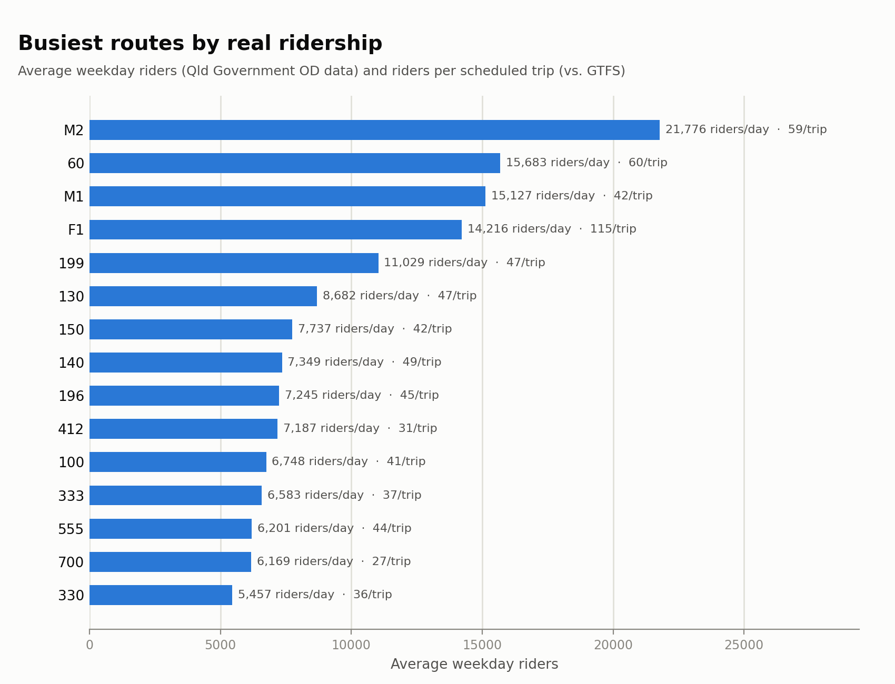
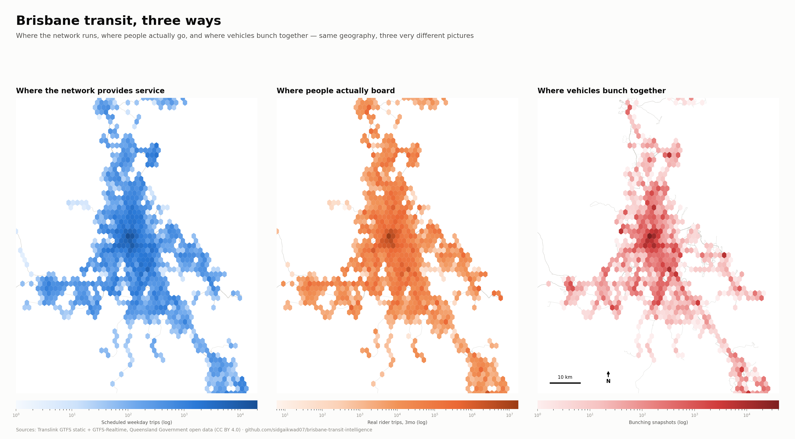

# Brisbane Transit Intelligence

I built this to see how far Brisbane's public transport open data could go. It pulls the GTFS
timetable, the live GTFS-Realtime feed, Brisbane City Council's traffic sensors and daily
weather into one pipeline that measures reliability, tries to predict delays, and shows where
the network is under strain.

It's a portfolio project, so I cared more about a pipeline that actually runs end to end than
about piling on features. Everything is local: Postgres with PostGIS, scheduled ingestion, dbt
models, an XGBoost delay model and a Streamlit dashboard, all started with
`docker compose up`.

## Why this project

Translink and Brisbane City Council both publish open feeds with no login required: a static
GTFS timetable, a live GTFS-Realtime feed (vehicle positions, trip updates and service alerts),
and live traffic readings from signalised intersections. I wanted to put all three together
and answer one question:

> **Where and when does Brisbane's bus network become unreliable, and how much of that comes
> from road congestion versus the way the timetable is designed?**

## Status

Still being built. [`ROADMAP.md`](ROADMAP.md) has the plan and what's done so far.

## Architecture

```text
                    ┌─────────────────────┐
                    │  Translink GTFS      │  static schedule (zip, daily)
                    │  (SEQ_GTFS.zip)      │
                    └──────────┬───────────┘
                               │
                    ┌─────────────────────┐
                    │  Translink GTFS-RT   │  vehicle positions, trip updates,
                    │  (protobuf, polled)  │  service alerts (polled every ~20s)
                    └──────────┬───────────┘
                               │
                    ┌─────────────────────┐
                    │  BCC Traffic API     │  intersection volume/occupancy
                    │  (Opendatasoft REST) │
                    └──────────┬───────────┘
                               │
                               ▼
                    ┌─────────────────────┐
                    │  ingestion/*.py      │  Python, scheduled via cron/
                    │                      │  APScheduler
                    └──────────┬───────────┘
                               │
                               ▼
                    ┌─────────────────────┐
                    │  PostgreSQL+PostGIS  │  raw tables (docker compose)
                    └──────────┬───────────┘
                               │
                               ▼
                    ┌─────────────────────┐
                    │  dbt models          │  staging → marts
                    │  (dbt-core, local)   │  (delay, on-time %, headway)
                    └──────────┬───────────┘
                               │
                 ┌─────────────┴─────────────┐
                 ▼                           ▼
        ┌─────────────────┐        ┌─────────────────┐
        │ Delay prediction │        │ Streamlit        │
        │ model (XGBoost)  │        │ dashboard         │
        └─────────────────┘        └─────────────────┘
```

## Data sources (all public, no auth required)

| Source | Format | Update frequency | Link |
|---|---|---|---|
| SEQ GTFS static | ZIP of CSVs | Periodic (versioned) | `https://gtfsrt.api.translink.com.au/GTFS/SEQ_GTFS.zip` |
| GTFS-RT Trip Updates | Protobuf | ~20-30s | `https://gtfsrt.api.translink.com.au/api/realtime/SEQ/TripUpdates` |
| GTFS-RT Vehicle Positions | Protobuf | ~20-30s | `https://gtfsrt.api.translink.com.au/api/realtime/SEQ/VehiclePositions` |
| GTFS-RT Service Alerts | Protobuf | On change | `https://gtfsrt.api.translink.com.au/api/realtime/SEQ/alerts` |
| BCC Intersection traffic volume | JSON (Opendatasoft) | Near real-time | `https://data.brisbane.qld.gov.au/explore/dataset/traffic-data-at-intersection/` |
| BCC Traffic signal locations | JSON (Opendatasoft) | Static (one-time pull) | `https://data.brisbane.qld.gov.au/explore/dataset/traffic-management-signal-locations/` |
| Brisbane daily weather | JSON | Daily (historical + forecast) | `https://archive-api.open-meteo.com/v1/archive` |

## Getting started

```bash
cp .env.example .env
docker compose up -d          # starts Postgres+PostGIS
pip install -r requirements.txt
python -m ingestion.gtfs_static           # loads the static schedule
python -m ingestion.gtfs_realtime_poller  # polls live feeds (Ctrl+C to stop)
python -m ingestion.od_trips              # loads the 3 most recent months of real ridership
python -m ingestion.bcc_traffic           # polls BCC intersection traffic (Ctrl+C to stop)
python -m ingestion.traffic_signal_locations  # one-time: signal locations, needed for the spatial join below
python -m ingestion.weather               # backfills daily Brisbane weather since 2026-01-01

# Once the traffic poller's been running a while:
python models/build_features.py           # spatial + temporal join -> data/exports/delay_features.csv
python models/train_delay_model.py        # trains + evaluates -> docs/delay_model_card.md
```

### Running the poller as a background service (macOS)

The poller has to run for hours or days before it collects anything useful, and leaving a
terminal open isn't practical. `scripts/install_poller_service.sh` installs it as a macOS
LaunchAgent instead. It starts on login and restarts itself if it crashes. I tested this by
killing the process with `kill -KILL`, and it was back up and polling within about 20 seconds.

```bash
scripts/install_poller_service.sh     # install + start
launchctl list | grep brisbane-transit  # check it's running
tail -f logs/poller.log                 # watch it poll
scripts/uninstall_poller_service.sh   # stop + remove
```

It can't do anything about the laptop going to sleep, which is the main thing that has
interrupted collection so far. It just means nobody has to notice and restart it by hand
afterwards. The plist is generated from
[`scripts/poller_service/com.brisbane-transit.poller.plist.template`](scripts/poller_service/com.brisbane-transit.poller.plist.template)
so no machine-specific paths get committed.

The BCC traffic feed needs the same setup. Its API only ever shows the last five minutes or so
and keeps no history, so as with GTFS-RT the only way to build up a time series is to keep
polling:

```bash
scripts/install_traffic_poller_service.sh     # install + start
tail -f logs/traffic_poller.log                 # watch it poll
scripts/uninstall_traffic_poller_service.sh   # stop + remove
```

Weather works the other way round. Open-Meteo's archive goes back to 1940, so
`python -m ingestion.weather` backfills the whole window in one go. It upserts by date, so
you can re-run it whenever you like without creating duplicates.

### Regenerating everything

Once the poller has been running for a while and `od_trips` is loaded, one command rebuilds
every finding, chart and export in the repo from the current data:

```bash
make refresh          # dbt run once, then every analysis + model script, then the CSV/XLSX exports
make refresh-fast     # same, minus the slow exports
```

[`scripts/refresh_all.py`](scripts/refresh_all.py) shows exactly what runs and in what order.
I wrote it after running six-plus scripts by hand in the right order became too easy to get
wrong. On its own it only updates local files. The weekly job below is what publishes them.

### Automation: health check + weekly refresh

Two scheduled jobs (macOS LaunchAgents) keep things up to date without anyone having to
remember:

```bash
make install-automation   # install both (needs `gh auth login` done once)
make health               # print data freshness now
make weekly-refresh ARGS=--no-pr   # dry run of the weekly job, no GitHub
scripts/uninstall_automation.sh
```

| Job | When | What it does |
|---|---|---|
| [`scripts/health_check.py`](scripts/health_check.py) | Every 15 min | Checks the newest row in each live table. Sends a macOS notification if one goes quiet (transit > 15 min, traffic > 30 min) or the database is down, a reminder every 6h, and another when it recovers |
| [`scripts/weekly_refresh.py`](scripts/weekly_refresh.py) | Mondays 06:00 | Reloads the Brisbane, Sydney and Melbourne timetables plus OD ridership, runs `refresh_all.py`, and opens a pull request with the regenerated docs for review |

Why each one exists:

- **Health check.** On 3 Oct 2026 the traffic poller looked fine but had been locked out by
  the BCC portal's daily limit (5,000 anonymous calls a day). It lost about 16 hours of data
  that can't be recovered. launchd's `KeepAlive` only notices crashes, so checking that new
  rows are actually arriving is the only reliable test. The poller itself now makes one
  bulk-export call per poll (about 720 a day) and sleeps until the quota resets if it ever
  runs out.
- **Weekly refresh.** The live tables keep themselves current, but the static data quietly
  goes out of date. Sydney Trains only publishes its timetable about a month ahead, so
  without a reload the city comparison would lose Sydney's rail network within weeks.

The weekly job works in a separate git worktree under `.worktrees/`, so it never touches your
working copy. It only commits `docs/` and never pushes to `main`. If a static load fails it
stops before analysing a half-loaded timetable, and if an analysis script fails the pull
request opens as a draft that lists what went wrong. Logs are in `logs/health_check.log` and
`logs/weekly_refresh.log`.

## Week 1 findings

The full breakdown is in [`docs/week1_findings.md`](docs/week1_findings.md), generated by
[`notebooks/network_summary.py`](notebooks/network_summary.py) from the static timetable for one
representative weekday. That last part matters. The feed republishes overlapping calendar
windows, so simply filtering on `calendar.monday = true` overstates trip counts several times
over ([`ingestion/service_calendar.py`](ingestion/service_calendar.py) explains how I resolve
it). Headline numbers: 12,768 stops with scheduled service, 494 routes and 20,853 scheduled
trips, 18,926 of them by bus.

[](docs/manly_lota_service_gap.md)
*Click the map for the Manly/Lota weekend service gap case study (flagged in orange, on the bayside east of the CBD).*

The busiest interchanges by number of routes are the South East Busway stations: Buranda (47
routes), Griffith University (40), Upper Mt Gravatt (32) and Roma Street (31). Cultural Centre
is the single busiest stop by trip volume.

## Case study: the Manly / Lota / Cleveland service gap

[`docs/manly_lota_service_gap.md`](docs/manly_lota_service_gap.md), generated by
[`notebooks/manly_lota_service_gap.py`](notebooks/manly_lota_service_gap.py), started with a
resident's two complaints: the buses don't come often enough, and the route takes too long. I
turned those into three things I could measure.

The Cleveland line at Manly runs about every 15 minutes in the weekday peak, but at weekends
it's a flat 30 minutes all day. The local bus corridor drops to one bus every 90 minutes on
Sunday mornings. When I compared it with every similarly busy stop in the city, though, the
gap wasn't specific to Manly or Lota. It's the same pattern citywide. Route circuity (how long
the route is compared with a straight line) told the same story: the buses here do take long
routes, but so do Brisbane buses almost everywhere.

One finding really is specific to this corridor. Queensland Government ridership data shows
its two main routes, **220 and 227, sit at the 93rd to 95th percentile of demand pressure
citywide**, about 2.5 times the network median in riders per scheduled trip. That's a clear
case for more weekday peak capacity on those two routes, and it's a separate issue from
weekend frequency across the city.

## Week 2 findings: on-time performance and bunching

The full breakdown is in [`docs/week2_findings.md`](docs/week2_findings.md), generated by
[`notebooks/realtime_summary.py`](notebooks/realtime_summary.py) through the dbt marts in
[`dbt/`](dbt/). It's my own measurement from the GTFS-Realtime data collected by
[`ingestion/gtfs_realtime_poller.py`](ingestion/gtfs_realtime_poller.py), not Translink's
official on-time figure. Over a collection window of several days that covers both weekday
and weekend service, about **69% of stop visits are on time** citywide. Rail and the Gold Coast
light rail are far more reliable than buses or ferries. A route needs at least 5 distinct
trips before it's ranked, so one badly delayed run can't make a quiet route look unreliable
across the board. The raw and summarised data can be exported to CSV or XLSX with
[`notebooks/export_week2_data.py`](notebooks/export_week2_data.py).


### Why weekday and weekend on-time performance look so close

Someone asked me this directly: weekday and weekend on-time performance are only a few points
apart, so if weekend service really is worse, why doesn't the number show it? The answer is in
[`docs/weekend_frequency_gap.md`](docs/weekend_frequency_gap.md), generated by
[`notebooks/weekend_frequency_gap.py`](notebooks/weekend_frequency_gap.py). **On-time
performance only measures the trips that run. It says nothing about how many trips exist.**
149 routes, carrying 7.4% of all weekday ridership, have no Saturday service at all, and 181
routes (9.5%) have no Sunday service. That's the actual weekend gap, and an on-time figure
can't show it. The routes that do keep running at weekends hold their frequency surprisingly
close to weekdays.

I also caught a bug while building this. An early version combined Saturday's and Sunday's
trips before calculating headway, which squeezed two days of trips into one day's span and
made weekend headways look about half as long as they are.


## Demand intelligence: actual ridership

The full breakdown is in
[`docs/demand_intelligence_findings.md`](docs/demand_intelligence_findings.md), generated by
[`notebooks/demand_intelligence.py`](notebooks/demand_intelligence.py). The data comes from
[`ingestion/od_trips.py`](ingestion/od_trips.py), which loads the Queensland Government's
monthly
[origin-destination trip data](https://www.data.qld.gov.au/dataset/translink-origin-destination-trips-2022-onwards)
(CC BY 4.0), covering go card, EMV and paper tickets. These are actual passenger counts, so I
didn't have to infer demand from delays or frequency.

Across three months (May to July 2026, 55.2M trips) the busiest route is the M2, with 21,776
riders a day. Joining ridership against scheduled trips, using the same representative-weekday
method as Week 1, gives **riders per scheduled trip**. The F1 CityCat carries about 115 riders
per sailing even though it isn't especially frequent, while route 700 carries about 27 despite
running far more often. That tells you where capacity is short, which a busy timetable on its
own doesn't. This data can also be exported to CSV or XLSX with
[`notebooks/export_demand_data.py`](notebooks/export_demand_data.py).



## Priority routes: where demand and unreliability overlap

The full breakdown is in [`docs/priority_routes_findings.md`](docs/priority_routes_findings.md),
generated by [`notebooks/priority_routes.py`](notebooks/priority_routes.py). It brings ridership
and on-time performance together, because a route that's both busy and unreliable makes far
more people late than either problem on its own.

**SMBI**, the Southern Moreton Bay Islands ferry, comes out on top. It carries 5,208 riders a
weekday, the 100th percentile for demand, and runs on time only 38% of the time, which puts it
at the 2nd percentile for reliability citywide. Routes 220 and 227 from the Manly/Lota/Cleveland
case study also turn up in the citywide top 15, which backs up what that case study found.


## Delay-prediction model (Week 3), and why it doesn't work yet

The full write-up is in [`docs/delay_model_card.md`](docs/delay_model_card.md). There are two
XGBoost models, one predicting delay in seconds and one predicting whether an arrival will be
more than 5 minutes late. Both are trained on polled delay observations joined to BCC
intersection traffic, daily weather and a count of active system-wide disruption alerts. The
traffic feed has no coordinates of its own, only a signal-controller ID, so
`ingestion/traffic_signal_locations.py` pulls BCC's separate signal-location dataset. That
lets `models/build_features.py` match each stop to nearby signals with a PostGIS `ST_DWithin`
join.

**The result:** on a time-based train/test split, which is the only fair way to evaluate this,
the model currently **does worse than a naive baseline**. There's a clear reason. The
collection window was only about 3.5 days and included a strike, which made 25 and 26 Sep much
less reliable than 27 and 28 Sep. A few days of data isn't enough for a model to learn across
a shift like that. To check that the features carry any signal at all, I also ran a random
split (same features, but it leaks timing information a real deployment wouldn't have). There
the regressor beats the baseline, 217s MAE against 242s, and so does the classifier. So the
problem is too little data, spanning too few disruptions, rather than bad features. I've
published the result as it stands because a negative result with a clear explanation is more
useful than a hand-picked split that hides it.


## City comparison: Brisbane vs. Sydney vs. Melbourne

The full write-up is in [`docs/city_comparison.md`](docs/city_comparison.md). I loaded the
static GTFS feeds for Sydney and Melbourne into their own schemas (`raw_syd` and `raw_mel`,
cloned from `raw` by [`scripts/setup_city_schema.py`](scripts/setup_city_schema.py)), so
Brisbane's tables aren't touched. All three are compared with the same representative-weekday
method as everything else here. None of the figures are taken from published reports.


Building it turned up two data-quality problems, and I've written both up rather than quietly
patching around them. Sydney's "Greater Sydney" feed actually covers the whole state (689
agencies, with 45% of stops outside a generous Sydney metro bounding box). And 88% of its
routes turned out to be dedicated school buses (route_type 712), which I only spotted by
reading the route names ("X to \<School Name\>"). They had to be excluded before the
comparison meant anything. The doc's caveats section has the details.

**This only compares timetables:** network size and mode mix, not measured reliability. The
more interesting comparison, on-time performance, needs Sydney's and Melbourne's GTFS-Realtime
feeds, and both require a free API key this project doesn't have. The "City comparison"
section of `ROADMAP.md` explains exactly what's blocked and what would unblock it.

## Project layout

```text
ingestion/     Python scripts pulling GTFS static, GTFS-RT, and traffic data
db/            Raw Postgres schema (DDL)
dbt/           dbt-core project: staging + mart models
models/        ML: delay prediction, feature engineering
dashboard/     Streamlit app
tests/         Unit + data-quality tests
docs/          Architecture notes, findings write-ups
```

## Live dashboard

```bash
streamlit run dashboard/app.py
```

[`dashboard/app.py`](dashboard/app.py) queries Postgres directly, using the same dbt marts and
raw tables as the reports above, so it's never more than a poll or two behind. A banner at the
top works out the most useful live fact each time it loads, such as which hour of the day is
currently least reliable and by how much. Each chart also comes with a short generated note
explaining what it shows. There are six tabs:

- **Live map:** every tracked vehicle's current position, coloured by how late it is, on a
  carto-darkmatter basemap that doesn't need an API key. You can switch to a citywide view of
  delay hotspots showing the average arrival delay at every stop.
- **Live delays:** the spread of arrival delays over the last 15 minutes, which routes are
  running late right now, and on-time percentage by hour of the day.
- **Worst routes & bunching:** the least reliable routes, with the full early/on-time/late
  breakdown rather than a single number, plus the most bunched routes, from the marts behind
  the [Week 2 findings](docs/week2_findings.md).
- **Ridership trends:** monthly ridership by mode, ridership by time of day, the busiest
  stations by actual trip volume, and a day-of-week by hour heatmap of scheduled stop visits.
  Time-of-day blocks are compared as average trips per day rather than raw totals, since
  weekday blocks cover five days and weekend blocks two. Building the mode breakdown exposed a
  gap in the demand marts. The OD dataset labels heavy rail and the Gold Coast light rail with
  their own codes ("Rail", "GCLR") instead of GTFS route numbers, so the route-name join was
  silently dropping about 36% of all ridership. This chart reclassifies them explicitly, and
  fixing it at the source in the other demand marts is still on the list.
- **Demand vs reliability:** the [priority routes](docs/priority_routes_findings.md) scatter
  plot and a top-10 bar chart, updated live.
- **Traffic & weather:** the BCC intersection congestion trend, current saturation levels and
  recent Brisbane weather. These are the Week 3 inputs to the delay model.

Just below the KPI row, an expandable **active service alerts** panel lists every disruption in
the latest GTFS-RT Service Alerts poll. It's the same feed behind the banners on Translink's
journey planner ("Reduced train timetables", "Weekend track closure" and so on), but polled
continuously into `raw.service_alerts` since Week 2 instead of read a page at a time. That
table had been filling up for over a week before anything in the repo used it.

A mode filter in the sidebar (Bus, Rail, Ferry, Tram) applies to every tab, and a refresh
button clears the cache. Queries also refresh on their own: every 60 seconds for the live
tables and every 10 minutes for the heavier joins. The theme is set in
[`.streamlit/config.toml`](.streamlit/config.toml).

## Shareable social image

[`docs/images/hero_dashboard.png`](docs/images/hero_dashboard.png), generated by
[`notebooks/hero_dashboard.py`](notebooks/hero_dashboard.py), pulls the headline number from
each finding above into one 4:5 portrait image sized for LinkedIn: network scale, citywide
on-time performance, ridership measured and the top priority route, plus the
demand-vs-reliability and busiest-routes charts. It doesn't calculate anything new. It only
reuses numbers from the other four scripts, so re-run those first if the data has moved on.

[`docs/images/transit_infographic.png`](docs/images/transit_infographic.png), generated by
[`notebooks/transit_infographic.py`](notebooks/transit_infographic.py), does the same job in a
magazine style built around icons and big numbers: network scale, then performance, then the
route to fix first and the runners-up. I drew the icons with matplotlib patches rather than an
emoji font, because matplotlib's Agg backend can't render colour emoji and an empty box looks
worse than no icon.

## Density heatmaps: supply, demand and bunching

The full breakdown is in [`docs/density_findings.md`](docs/density_findings.md), generated by
[`notebooks/density_heatmaps.py`](notebooks/density_heatmaps.py). It draws three hexbin
heatmaps over the same area of Greater Brisbane: where service is scheduled, where people
actually board, and where vehicles bunch together. You can pick out the branching shape of the
rail and busway network in all three. The interesting part is how they differ. Supply and
demand line up closely overall, but bunching is packed much more tightly around the CBD and the
South East Busway than either.



## License

Code: MIT. Data: subject to Translink and Brisbane City Council's open data licenses
(CC BY 4.0).
