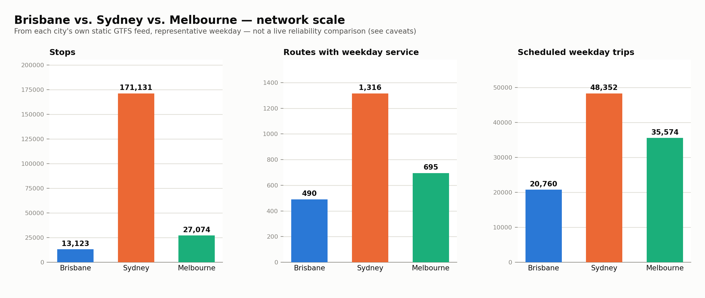

# Brisbane vs. Sydney vs. Melbourne — network scale comparison

Built from each city's own public static GTFS feed, loaded into its own schema (`raw` / `raw_syd` / `raw_mel`) using the exact same representative-weekday methodology as every other finding in this repo (`ingestion/service_calendar.py`) — real data, computed the same way for all three, not quoted from a published report.

**This is a static-schedule comparison only.** It answers "how big is each network and what does it schedule," not "which one actually runs on time" — that needs each city's live GTFS-Realtime feed over a real collection window, the way `docs/week2_findings.md` does for Brisbane. Sydney and Melbourne's real-time feeds require a free API key (Transport for NSW / Transport Victoria open data portals) that this project doesn't have yet — see `ROADMAP.md` for what's blocked on that and what to do about it.

## Headline numbers

| City | Scope | Agencies | Representative weekday | Stops | Routes | Scheduled trips |
|---|---|---|---|---|---|---|
| Brisbane | SEQ (Greater Brisbane + regional) | 1 | Thu 29 Oct 2026 | 13,123 | 490 | 20,760 |
| Sydney | All of NSW — statewide, not metro-only (see caveats) | 692 | Wed 21 Oct 2026 | 171,131 | 1,316 | 48,352 |
| Melbourne | Metro Melbourne (train/tram/bus only) | 3 | Wed 14 Oct 2026 | 27,074 | 695 | 35,574 |

## Mode mix (scheduled weekday trips)

### Brisbane

| Mode | Routes | Scheduled trips | Trips/route |
|---|---|---|---|
| Bus | 435 | 18,901 | 43 |
| Ferry | 9 | 844 | 94 |
| Rail | 45 | 742 | 16 |
| Tram/Light Rail | 1 | 273 | 273 |

### Sydney

| Mode | Routes | Scheduled trips | Trips/route |
|---|---|---|---|
| Bus | 1,125 | 42,034 | 37 |
| Rail | 17 | 3,229 | 190 |
| Tram/Light Rail | 6 | 1,392 | 232 |
| Ferry | 24 | 1,120 | 47 |
| Metro/Subway | 1 | 434 | 434 |
| Coach | 120 | 120 | 1 |
| Other (type 106) | 23 | 23 | 1 |

### Melbourne

| Mode | Routes | Scheduled trips | Trips/route |
|---|---|---|---|
| Bus | 476 | 24,198 | 51 |
| Tram/Light Rail | 24 | 5,044 | 210 |
| Other (type 701) | 176 | 3,504 | 20 |
| Rail | 19 | 2,828 | 149 |

## Method & caveats

- **Sydney's route/trip totals above already exclude School Bus service (route_type 712)** — 8,507 dedicated school-only routes, 11,472 scheduled trips, identified by inspecting actual route names in the raw feed (they're literally "X to <School Name>") after noticing this single category was 88% of Sydney's total route count and would have made the headline comparison meaningless if left in unlabeled. Excluded the same way Melbourne's V/Line regional/interstate sub-feeds are excluded — a documented scoping choice, not a silent drop.
- **Even after that exclusion, Sydney's feed is still statewide, not metro-scoped — found while building this comparison, not something to gloss over.** Its 692 agencies include regional NSW operators and train-replacement bus services, and stops as far away as ~7,585km apart in latitude alone (real Sydney metro spans maybe 80km — a span this large also implies some stops carry corrupted coordinates, not just legitimately-distant regional stops). A direct check: **76,729 of Sydney's 170,908 stops (45%) fall outside a generous Sydney-metro bounding box** (lat -35 to -32, lon 149 to 152) — so the headline Sydney numbers still overstate metro Sydney's actual size relative to Brisbane and Melbourne (both scoped tighter). Re-scoping to Sydney-metro-only agencies is a real follow-up (Phase 1b), not done here — flagging honestly rather than either silently filtering with an under-researched agency list or presenting the inflated number unqualified. **Done in `docs/city_service_quality.md`**, which clips all three feeds to their ABS Greater Capital City boundaries.
- **Scope differs by necessity, not choice**: Brisbane's feed (SEQ) includes some regional service around Greater Brisbane; Sydney's is the full "Greater Sydney" feed as published; Melbourne's static feed is a zip of separate per-mode sub-feeds (regional trains, metro trains, trams, metro buses, regional coach, regional town bus, interstate rail, SkyBus — identified by inspecting each one's route_type, not documented anywhere obvious) and this comparison includes only the metro train/tram/bus sub-feeds, excluding V/Line regional/interstate rail and coach and the SkyBus premium airport service, to keep the comparison closer to like-for-like. None of the three is a perfectly equivalent boundary.
- **Corrected 2026-10-01: Sydney's representative weekday originally had no Sydney Trains service.** Sydney Trains only publishes its timetable about a month ahead (to 28 Oct 2026), while the rest of the NSW feed runs to late December, so the "typical" date picked from the whole span (24 Nov) had ~170 rail trips instead of ~3,200. Dates are now picked only from the window where every regular mode's timetable is published (`ingestion/service_calendar.complete_schedule_end`). Sydney's weekday trip total rose from 44,860 to the figure above.
- **Sydney's stop count double-counts.** The NSW feed lists most stop poles twice: once as a boarding stop and once as a parent "station" record (location_type 1). Stops that actually have departures are counted properly in `docs/city_service_quality.md` (26,813 inside Greater Sydney on a weekday, vs 18,668 Melbourne and 9,855 Brisbane).
- **Mode classification uses extended GTFS route_type codes** where a feed uses them (Melbourne's metro trains are coded 400, not the standard 2) — mapped in `classify_mode()`; any route_type not in that mapping shows as "Other (type N)" rather than being silently dropped or misclassified.
- **"Routes with weekday service" counts distinct route_id, not route_short_name** — unlike this repo's Brisbane-only reports, which mostly use route_short_name because OD ridership data is keyed on it. That choice doesn't apply here (no ridership data for Sydney/Melbourne), so this uses the more standard route_id.
- This is one representative weekday's *schedule*, not measured ridership or measured reliability — a bigger scheduled-trip count doesn't by itself mean a better-run network, only a larger one.
- **Each city's representative weekday is a different calendar date** (Brisbane: 29 Oct 2026, Sydney: 21 Oct 2026, Melbourne: 14 Oct 2026) — each picked independently as the date closest to that *feed's own* median trip count within its own validity window (`ingestion/service_calendar.py`), so the three dates aren't the same day and each feed's validity window doesn't line up with the others'. This is a schedule-structure comparison, not a same-day comparison.
