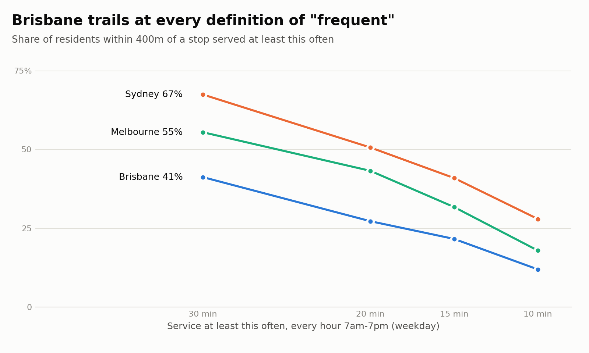
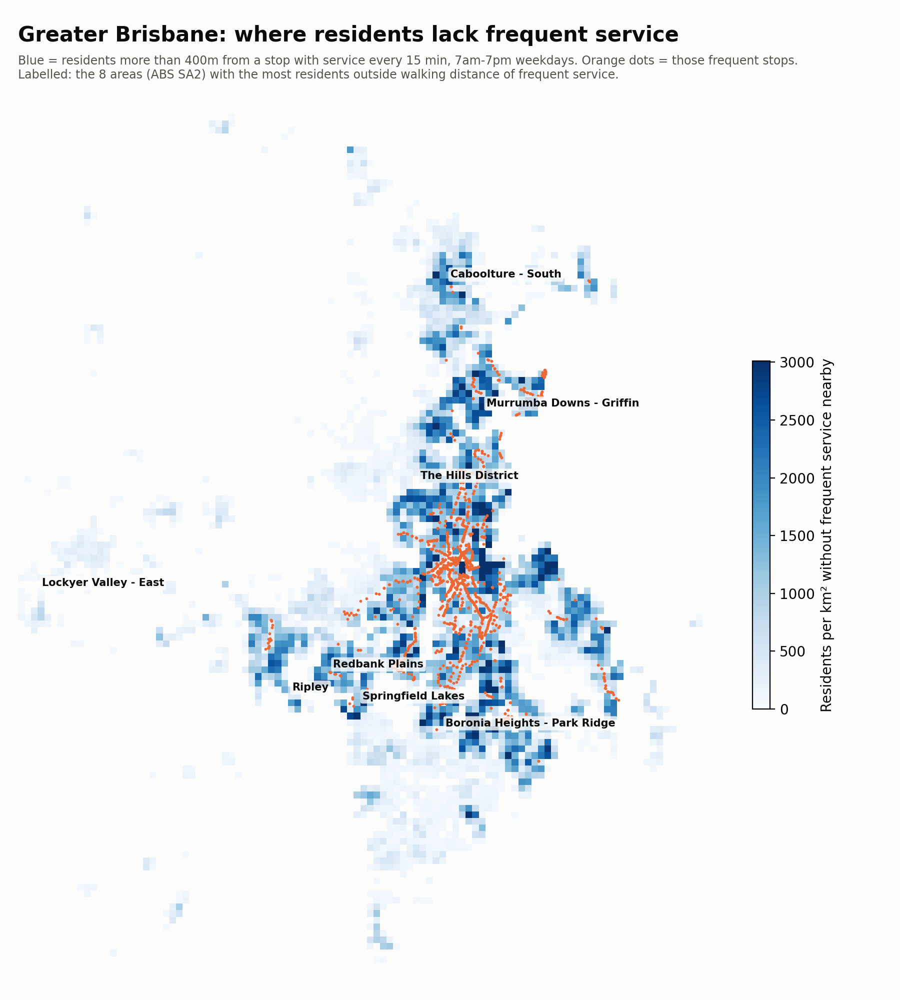

# Brisbane vs. Sydney vs. Melbourne — service quality where people live

Phase 1 (`docs/city_comparison.md`) compared how *big* each network is. This compares how *useful* it is to the people who live there: what share of residents can walk to a stop (400m, about 5 minutes) that has frequent service. All three cities are measured the same way, inside the same kind of boundary, from their own published timetables (`notebooks/city_service_quality.py`).

## Key insights

1. **Brisbane's problem is frequency, not reach.** 70% of Greater Brisbane residents live within 400m of a stop with weekday service — close to Melbourne (73%). But only **22%** live near a stop with service every 15 minutes or better all day, against 32% in Melbourne and 41% in Sydney. Of the residents who have a stop nearby, about 31 in 100 have a *frequent* one in Brisbane, vs. 43 in Melbourne and 46 in Sydney. Brisbane spreads its service thinly across many low-frequency routes.
2. **The gap is about 282K people.** That's how many more Greater Brisbane residents would need frequent service within walking distance for Brisbane to match Melbourne's share, at today's population.
3. **Brisbane runs less service per resident.** 0.15 scheduled stop departures per resident per weekday, vs 0.19 in Melbourne (+28%) and 0.26 in Sydney (+70%). Thin frequency (insight 1) follows directly from that.
4. **Evenings are weak.** Only 19% of Brisbane residents live near a stop with service at least every 30 minutes from 8pm to midnight, about half of Sydney's 40% (Melbourne 29%). Most Brisbane residents can't rely on a bus or train home after a late shift without a long walk or wait.
5. **Large areas have essentially no frequent service.** 56 Greater Brisbane areas (ABS SA2s) with 10,000+ residents each have under 5% of residents near frequent service — **904K people, 32% of the city** (Melbourne 25%, Sydney 10%). The largest are outer suburbs: see the map and table below.
6. **Weekends: Brisbane holds up comparatively well, Melbourne doesn't.** Brisbane's frequent coverage falls 35% from weekday to Sunday, about the same as Sydney (36%). Melbourne's falls 59% — its Sunday frequent coverage (13%) ends up *below* Brisbane's (14%), even though Melbourne runs the most Sunday service relative to its weekday (65% of weekday departures, vs Brisbane 43%). Brisbane cuts more Sunday service overall, but the cuts fall mostly outside its frequent corridors; Melbourne keeps more service running but at frequencies below the 15-minute line.
7. **Half of Brisbane's growth is landing where there's no frequent service.** 135K of the 266K people added to growing Brisbane areas since 2021 (51%) live in areas where under 5% of residents have frequent service nearby, somewhat more than those areas' share of the existing population (43%). The skew is modest, though: well-served inner areas grew in line with their population too, so on average new residents are about as well served as existing ones (21% vs 22%). The gap is mostly network-wide, with growth corridors adding to it rather than causing it.

## The finding doesn't depend on where "frequent" is drawn

| Service at least every... | Brisbane | Sydney | Melbourne |
|---|---|---|---|
| 30 min | 41% | 67% | 55% |
| 20 min | 27% | 51% | 43% |
| 15 min | 22% | 41% | 32% |
| 10 min | 12% | 28% | 18% |

## Where Brisbane's gaps are

Areas with the most residents more than 400m from frequent weekday service:

| Area (ABS SA2) | Residents (2025 grid) | Without frequent service | Share with frequent service | Growth 2021-25 |
|---|---|---|---|---|
| Boronia Heights - Park Ridge | 28,760 | 28,616 | 0% | +7,509 |
| Redbank Plains | 29,970 | 28,005 | 7% | +4,136 |
| Ripley | 25,734 | 25,734 | 0% | +10,417 |
| Murrumba Downs - Griffin | 26,059 | 25,665 | 2% | +3,574 |
| Springfield Lakes | 26,086 | 25,442 | 2% | +5,482 |
| Lockyer Valley - East | 24,188 | 24,188 | 0% | +2,522 |
| The Hills District | 23,532 | 23,532 | 0% | +1,394 |
| Caboolture - South | 24,078 | 22,922 | 5% | +3,679 |
| Narangba | 22,346 | 22,102 | 1% | +2,333 |
| Kallangur | 22,497 | 21,713 | 3% | +1,268 |
| Jimboomba - Glenlogan | 21,191 | 21,191 | 0% | +3,172 |
| Burpengary | 21,071 | 20,725 | 2% | +2,340 |
| Cashmere | 20,592 | 20,592 | 0% | +1,412 |
| Thornlands | 21,054 | 19,732 | 6% | +2,199 |
| Deception Bay | 23,431 | 19,340 | 17% | +2,190 |

These cluster in three corridors: **Ipswich/Springfield** (Ripley, Redbank Plains, Springfield Lakes), **Moreton Bay north** (Narangba, Kallangur, Burpengary, Murrumba Downs, Caboolture South) and **Logan south** (Park Ridge, Jimboomba), plus established outer suburbs in the north-west (The Hills District, Cashmere). Ripley alone grew by over 10,000 people since 2021 and has no frequent service at all.

## Full results

| Measure | Brisbane | Sydney | Melbourne |
|---|---|---|---|
| Residents in boundary (ABS grid, 2025) | 2.79M | 5.52M | 5.41M |
| Boundary area | 15,842 km² | 12,369 km² | 9,993 km² |
| Representative weekday | 2026-09-17 | 2026-10-20 | 2026-10-29 |
| Stops with weekday service | 9,855 | 26,813 | 18,668 |
| Routes with weekday service | 398 | 738 | 485 |
| Weekday stop departures | 421,273 | 1,420,417 | 1,049,456 |
| Weekday departures per resident | 0.15 | 0.26 | 0.19 |
| Frequent stops, weekday | 1,296 | 4,833 | 4,366 |
| Near any stop, weekday | 70% | 88% | 73% |
| Near frequent stop, weekday | 22% | 41% | 32% |
| Near evening stop, weekday | 19% | 40% | 29% |
| Near frequent stop, Saturday | 16% | 32% | 19% |
| Near frequent stop, Sunday | 14% | 26% | 13% |
| Sunday departures as share of weekday | 43% | 58% | 65% |
| New residents 2021-25 near frequent stop | 21% | 42% | 33% |

## Method

- **Boundary:** each feed is clipped to its ABS Greater Capital City Statistical Area (GCCSA, ASGS 2021). This fixes Phase 1's mismatch: Sydney's feed covers all of NSW and Brisbane's covers all of South East Queensland, including the Gold and Sunshine Coasts, which aren't in Greater Brisbane.
- **Residents:** ABS Australian Population Grid 2025 (1km cells, ERP at 30 June 2025). Grid totals inside each boundary are within 2% of the ABS published ERP (cells straddling the boundary are assigned by their centre). People are assumed to be spread evenly within each 1km cell; the share of a cell within 400m of a stop is estimated from a 10×10 grid of sample points.
- **Service:** scheduled departures per stop per hour on one representative weekday, Saturday and Sunday per city, picked by `ingestion/service_calendar.py` as the date with the median trip count. A trip's final stop and any no-pickup stop are not counted as departures. Sydney's school-only routes (route_type 712) are excluded.
- **Frequent** = at least 4 departures in *every* hour from 7:00 to 18:59, counting all routes at that stop together. **Evening** = at least 2 departures in every hour from 20:00 to 23:59. Stops are counted individually (a stop is usually one direction of travel), so a stop with 2 buses an hour each way on opposite sides of a road is not "frequent".
- **Growth:** ABS Regional population 2024-25, ERP by SA2 for 2021 and 2025. The share of new residents near frequent service weights each growing SA2's increase by that SA2's *current* coverage.

## Caveats

- **This is the timetable, not what actually runs.** Cancellations and delays aren't counted. Comparing delivered service needs Sydney's and Melbourne's real-time feeds (Phase 2, blocked on API keys, see `ROADMAP.md`).
- **Representative dates differ by city** (see the table), each picked from its own feed. Sydney's is restricted to dates before 29 Oct 2026: Sydney Trains only publishes its timetable about a month ahead, while the rest of the NSW feed runs to late December. Without that restriction, Sydney's "typical" weekday has no Sydney Trains service at all. Phase 1 had this bug and has been corrected.
- **Melbourne excludes V/Line**, which runs some frequent regional trains through outer Greater Melbourne (e.g. Melton, Wyndham Vale), so Melbourne's coverage is slightly understated.
- **400m straight-line distance**, not walking distance along streets. It overstates access where there are barriers (rivers, motorways, cul-de-sac estates), which mostly affects outer suburbs, so the gaps above are if anything understated.
- **Frequency at a stop isn't the whole story**: it doesn't capture speed, directness, or where the service goes. A frequent bus that crawls to the CBD scores the same as a fast train.
