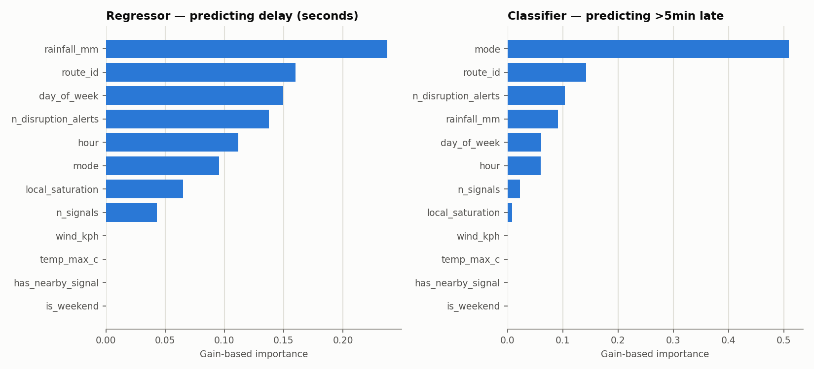

# Delay-prediction model card

Two XGBoost models — a regressor for arrival delay in seconds, and a classifier for whether a trip runs more than 5 minutes late — trained on real polled GTFS-Realtime delay observations joined against BCC intersection traffic (spatial join, nearest signal within 400m) and daily Brisbane weather.

## Data window and honesty check

- **1,267,120 tracked (trip, stop) arrivals**, 2026-09-25 00:00 to 2026-10-08 13:12 UTC
- This window is short — about 13 days — bounded by when the BCC traffic poller started (it has no historical backfill; see `ingestion/bcc_traffic.py`). Treat every number below as a first read from real but limited data, not a claim about Brisbane transit in general.
- Only **17%** of arrivals have a traffic signal within 400m of their stop (most Brisbane stops aren't at signalized intersections). XGBoost handles this natively via missing-value-aware splits rather than imputation — `has_nearby_signal` is included explicitly so the model can use "no signal nearby" as a feature in its own right.
- Weather varies over only a handful of distinct days in this window, so `rainfall_mm`/`temp_max_c`/`wind_kph` carry weak signal here by construction — more data needed before trusting a weather effect either way.
- **13.9% of arrivals are >5min late** in this window — the classifier's baseline is a majority-class predictor (always predict "not late"), not a coin flip.

## Method

- **Split:** time-based, not random — trained on the earliest 80% by scheduled arrival (1,013,683 rows), tested on the most recent 20% (253,437 rows). A random split would let autocorrelated conditions (a bad hour stays bad) leak from test into train and overstate performance.
- **Features:** mode, route_id (both native XGBoost categoricals, no one-hot), hour, day of week, is_weekend, local traffic saturation + signal count, has_nearby_signal, rainfall, max temp, wind.
- **Deliberately excluded:** `stop_id` — thousands of distinct values against a few weeks of data would let the model memorize specific stops rather than learn a pattern that generalizes.

## Results

### Time-based split (the real deployment scenario)

### Regressor — arrival delay (seconds)

| | MAE |
|---|---|
| Model | 272s |
| Baseline (predict train-set mean) | 258s |

### Classifier — is this trip >5min late?

| Metric | Model | Baseline (majority class) |
|---|---|---|
| Accuracy | 0.845 | 0.845 |
| Precision | 0.414 | — |
| Recall | 0.012 | — |
| F1 | 0.024 | — |
| ROC-AUC | 0.617 | 0.500 |

Test-set positive rate (actually >5min late): 15.5%

**The time-split model currently loses to its own baseline (272s MAE vs. 258s; 0.845 accuracy vs. 0.845).** The test set covers 2026-10-04 07:28 to 2026-10-08 13:12 UTC. Average delay swings a lot from day to day (2026-09-25: 180s avg; 2026-09-26: 144s avg; 2026-09-27: 47s avg; 2026-09-28: 133s avg; 2026-09-29: 83s avg; 2026-09-30: 187s avg; 2026-10-01: 86s avg; 2026-10-02: 85s avg; 2026-10-03: 136s avg; 2026-10-04: 143s avg; 2026-10-05: 146s avg; 2026-10-06: -17s avg; 2026-10-07: -12s avg; 2026-10-08: 79s avg), and daily row counts are very uneven (244 to 257,660) because collection had gaps. Route, hour and day-of-week features can't anticipate a day-level swing (a strike, an incident, a holiday timetable) they haven't seen, so a constant set to the training mean is hard to beat whenever the test days behave differently from the training days. The features also have no public-holiday flag, so a holiday is treated as an ordinary weekday. More days of data spanning several of these swings, and a holiday feature, are the fixes; a different model isn't.

### Random split (diagnostic only — not a valid deployment estimate)

To check whether the model can learn *any* signal at all from these features, absent the regime-shift problem: the same model, same features, but train/test rows drawn i.i.d. rather than split by time (test rows now overlap the same days as training, so this **leaks information a real deployment would never have** — it exists only to isolate the regime-shift effect from a does-the-model-work-at-all question).

| | Regressor MAE | Classifier accuracy | Classifier ROC-AUC |
|---|---|---|---|
| Model | 214s | 0.874 | 0.843 |
| Baseline | 236s | 0.862 | 0.500 |

The model beats baseline here, confirming the features do carry real signal — the time-split result above is a problem of too few, too uneven days, not a broken feature set.

## Feature importance

## Caveats

- A first pass, not a production model — the collection window is short and grows every day the pollers keep running; re-run `models/build_features.py` + `models/train_delay_model.py` periodically to retrain on more data.
- Traffic-signal coverage is spatial-proximity-based (nearest signals within 400m), not a confirmed causal link between that specific intersection and that specific trip's route.
- No per-route delay-driver breakdown yet (the roadmap's original ask) — global feature importance only. SHAP values per route is the natural next step once there's enough data per route to support it.
