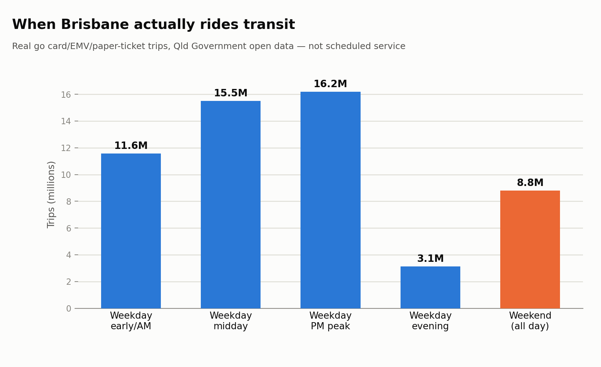

# Demand intelligence — real ridership from Queensland Government OD data

Source: [TransLink Origin-Destination Trips](https://www.data.qld.gov.au/dataset/translink-origin-destination-trips-2022-onwards), Queensland Government open data (CC BY 4.0) — **May 2026, June 2026, July 2026** (55,234,900 total trips across the window). Already aggregated by TransLink (one row per operator/month/route/direction/time-band/ticket-type/origin/destination with a trip count) — not individual smart-card taps.

## When people actually ride

| Time period | Trips | Share |
|---|---|---|
| Weekday early/AM | 11,581,344 | 21.0% |
| Weekday midday | 15,510,972 | 28.1% |
| Weekday PM peak | 16,199,579 | 29.3% |
| Weekday evening | 3,135,355 | 5.7% |
| Weekend (all day) | 8,807,606 | 15.9% |

## Real demand vs. scheduled supply, by route

Actual average weekday riders per route (from the OD data, divided by 66 weekdays in May 2026, June 2026, July 2026) against scheduled trips on **Thursday, 17 September 2026** (the same representative-weekday methodology as `docs/week1_findings.md`). `riders_per_scheduled_trip` is the number nothing else in this repo could produce before now — real demand pressure per scheduled service, not a frequency or on-time-performance proxy for it.

### Busiest routes overall (by average weekday riders)

| Route | Mode | Avg weekday riders | Scheduled trips | Riders/trip |
|---|---|---|---|---|
| M2 | Bus | 21,776 | 366 | 59 |
| 60 | Bus | 15,683 | 262 | 60 |
| M1 | Bus | 15,127 | 364 | 42 |
| F1 | Ferry | 14,216 | 124 | 115 |
| 199 | Bus | 11,029 | 235 | 47 |
| 130 | Bus | 8,682 | 186 | 47 |
| 150 | Bus | 7,737 | 185 | 42 |
| 140 | Bus | 7,349 | 151 | 49 |
| 196 | Bus | 7,245 | 162 | 45 |
| 412 | Bus | 7,187 | 232 | 31 |
| 100 | Bus | 6,748 | 165 | 41 |
| 333 | Bus | 6,583 | 178 | 37 |
| 555 | Bus | 6,201 | 141 | 44 |
| 700 | Bus | 6,169 | 231 | 27 |
| 330 | Bus | 5,457 | 153 | 36 |

### Most demand-pressured (highest riders per scheduled trip, ≥5 scheduled trips)

| Route | Mode | Avg weekday riders | Scheduled trips | Riders/trip |
|---|---|---|---|---|
| F1 | Ferry | 14,216 | 124 | 115 |
| SMBI | Ferry | 5,208 | 61 | 85 |
| 60 | Bus | 15,683 | 262 | 60 |
| M2 | Bus | 21,776 | 366 | 59 |
| F11 | Ferry | 1,007 | 19 | 53 |
| 140 | Bus | 7,349 | 151 | 49 |
| 199 | Bus | 11,029 | 235 | 47 |
| 130 | Bus | 8,682 | 186 | 47 |
| 551 | Bus | 464 | 10 | 46 |
| 561 | Bus | 453 | 10 | 45 |
| 196 | Bus | 7,245 | 162 | 45 |
| 573 | Bus | 1,106 | 25 | 44 |
| 555 | Bus | 6,201 | 141 | 44 |
| 150 | Bus | 7,737 | 185 | 42 |
| M1 | Bus | 15,127 | 364 | 42 |

### Least demand-pressured (lowest riders per scheduled trip, ≥5 scheduled trips)

| Route | Mode | Avg weekday riders | Scheduled trips | Riders/trip |
|---|---|---|---|---|
| R348 | Bus | 4 | 21 | 0 |
| 50 | Bus | 50 | 54 | 1 |
| 313 | Bus | 6 | 6 | 1 |
| F22 | Ferry | 140 | 140 | 1 |
| 701 | Bus | 121 | 119 | 1 |
| 589 | Bus | 48 | 40 | 1 |
| F24 | Ferry | 197 | 142 | 1 |
| 30 | Bus | 103 | 68 | 2 |
| 304 | Bus | 27 | 15 | 2 |
| 40 | Bus | 108 | 57 | 2 |
| 580 | Bus | 124 | 58 | 2 |
| 604 | Bus | 17 | 8 | 2 |
| 263 | Bus | 20 | 9 | 2 |
| 698 | Bus | 75 | 31 | 2 |
| 644 | Bus | 56 | 22 | 3 |

## Busiest origin-destination pairs

| Origin | Destination | Trips (window total) |
|---|---|---|
| Cavill Avenue station, platform 1 | Broadbeach South station, platform 1 | 123,372 |
| Broadbeach South station, platform 1 | Cavill Avenue station, platform 1 | 123,166 |
| Helensvale station, platform 5 | Gold Coast University Hospital station, platform 1 | 102,822 |
| Gold Coast University Hospital station, platform 1 | Helensvale station, platform 5 | 100,157 |
| Fortitude Valley station, platform 1 | Central station, platform 1 | 98,791 |
| Central station, platform 1 | Fortitude Valley station, platform 1 | 85,693 |
| Springfield Central station, platform 1 | Central station, platform 1 | 76,802 |
| Central station, platform 1 | Springfield Central station, platform 1 | 76,318 |
| UQ Lakes stop A | King George Square, 1c | 72,877 |
| UQ Chancellor's Place, zone D | Benson St at Toowong, stop 14 | 65,451 |
| Northgate station, platform 1 | Central station, platform 1 | 63,687 |
| Ferny Grove station, platform 1 | Central station, platform 1 | 63,355 |
| Cavill Avenue station, platform 1 | Broadbeach North station, platform 1 | 63,152 |
| Bulimba ferry terminal | Teneriffe ferry terminal | 62,680 |
| Central station, platform 1 | Northgate station, platform 1 | 61,268 |

## Method & caveats

- **This is real ridership**, not a schedule-derived proxy — go card/EMV trips are counted from an actual touch-on + touch-off pair; paper tickets are counted at point of issue. See the dataset's own readme for exact definitions.
- `riders_per_scheduled_trip` divides two different-precision things: OD ridership averaged over a full month (smoothing out day-to-day variation) against scheduled trips on *one* representative weekday. Treat it as directional — a route-level demand pressure signal, not a per-trip load figure.
- Route matching is by **route short name** (e.g. "60", "F50") — the OD data has no GTFS route_id, and the static feed republishes the same route number across timetable-version-specific route_id rows, so this is the only reliable join key.
- Weekday count for the daily-average calculation is business days (Mon-Fri); it doesn't subtract public holidays, so the true daily average is a little higher than shown.
- A handful of origin-destination stop pairs don't resolve to a name — those stop IDs aren't in the current static feed (renumbered or retired since the OD data's earliest coverage). The trip counts are still real; only the display name is missing.
- **Origin-destination pairs exclude same-stop trips** (origin = destination, ~3.5% of all trips, ~1.9M over the window) — these cluster heavily at major interchange stations and most likely represent loop/re-entry journeys rather than point-to-point travel, so including them would dominate the ranking without answering "where are people actually going."
- **The OD window (May-Jul 2026) and the GTFS static snapshot (Sept 2026) are ~2 months apart** — a route renumbered, restructured, or discontinued in between would produce a bogus extreme riders/trip ratio (real historical riders against wrong or zero current scheduled trips, or vice versa). Treat routes at the extreme ends of the demand-pressure tables as leads to verify, not settled conclusions, until cross-checked against a same-period schedule.
