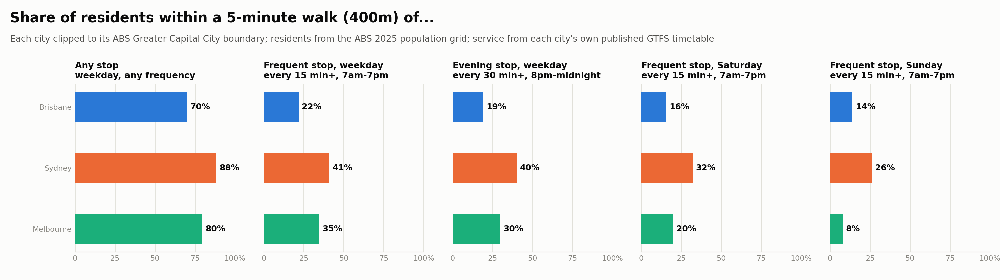
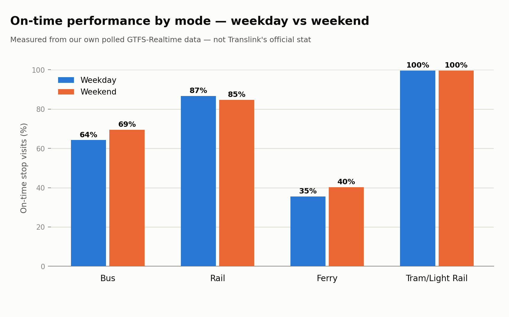
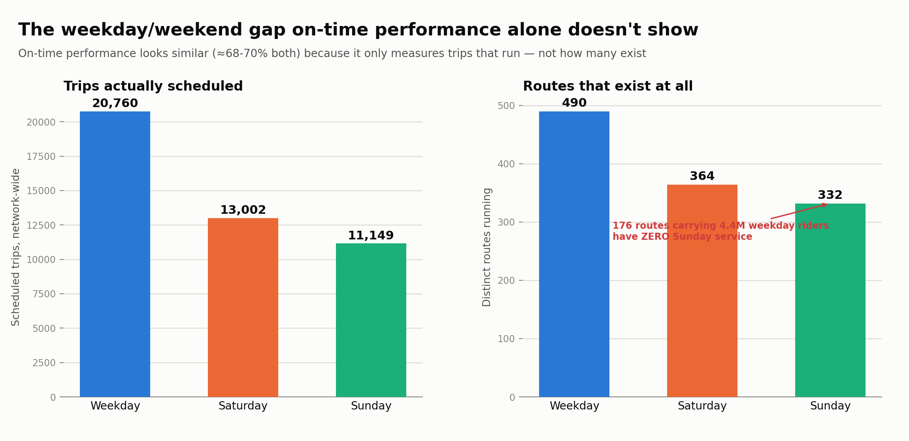

# What the data showed

This is the short version of the project. Over about three weeks I pulled Brisbane's public
transport timetable, its live GTFS-Realtime feed, the state government's real ridership data,
Brisbane City Council's traffic sensors, daily weather, and the timetables and population grids
for Sydney and Melbourne. Each section below links to the doc with the full numbers and method.

The question I started with was: **where and when does Brisbane's bus network become unreliable,
and how much of that comes from road congestion versus the way the timetable is designed?** The
honest answer is that the timetable explains more than I expected, and I couldn't yet measure
how much congestion contributes. The four findings below are the ones I'd stand behind.

## 1. Brisbane's problem is frequency, not reach

70% of Greater Brisbane residents live within 400m of a stop, not far behind Melbourne's 80%. But
only **22%** live near a stop with service every 15 minutes or better through the day, against
**35%** in Melbourne and **41%** in Sydney. Brisbane comes last at every frequency threshold I tested
(30, 20, 15 and 10 minutes), so the result doesn't depend on where you draw the line.

Matching Melbourne would mean bringing about 362,000 more people within walking distance of
frequent service. Redrawing routes alone can't do that without cutting reach somewhere else:
Brisbane schedules 0.15 stop departures per resident per weekday, against 0.22 in Melbourne and
0.26 in Sydney. Half of the city's recent population growth landed in areas with almost no
frequent service, mostly in three corridors: Ipswich/Springfield, Moreton Bay north and Logan
south.

Source: [`city_service_quality.md`](city_service_quality.md).

## 2. Ferries are the least reliable mode by a wide margin

Measured from three weeks of polled live data (1.9 million stop visits, 19 September to 10
October), 68.2% of stop visits were on time, meaning no more than a minute early or five minutes
late. Light rail was almost perfect (100%), rail was 85-87% and buses 64-69%. Ferries managed
**35% on weekdays** and 40% at weekends. Five of the eight least punctual routes in the network
are ferries, and they miss by running *early*: 73-90% of their stops are reached more than a
minute ahead of the timetable. That points at padded timetables rather than slow boats.

Crossing reliability against real ridership puts the **Southern Moreton Bay Islands ferry**
at the top of the whole network's priority list. It is in the 99th percentile for riders per
scheduled trip (about 5,200 riders a weekday) and ran on time 30% of the time. Behind it are two
more ferries (F11 and the CityCat F1) and a group of busy bus routes that are on time less than
55% of the time, many of them Logan-corridor services (546, 551, 561, 573, 577, 581) and city
"Rocket" or express routes (443, 141, 357, 426, 431).

Sources: [`week2_findings.md`](week2_findings.md), [`priority_routes_findings.md`](priority_routes_findings.md).

## 3. At weekends, whole routes disappear

Weekday and weekend on-time performance are within a few points of each other, which looks
reassuring until you count the routes. **176 routes that run on weekdays have no Sunday service
at all.** Together they carry 4.4 million weekday trips over three months, about 9.5% of weekday
ridership. Routes that do run at weekends keep close to their weekday frequency (an average wait
of 7.7 minutes against 7.8). So the weekend gap is about coverage, not frequency, and on-time
performance can't see it because a trip that doesn't exist can't run late.

The peer comparison backs this up. Brisbane's Sunday timetable has only 43% of its weekday
departures, the lowest of the three cities, but its frequent corridors hold up about as well as
Sydney's. The cuts fall on routes outside them.

Source: [`weekend_frequency_gap.md`](weekend_frequency_gap.md).

## 4. The delay model didn't work yet, and the reason is useful

I trained XGBoost models to predict delay from route, time, nearby traffic, weather and active
disruption alerts. On a fair time-based split, using about two weeks of data, they still **don't
beat a naive baseline** (275s mean absolute error against 232s), although the "more than five
minutes late" classifier does rank trips better than chance (ROC-AUC 0.65). The first run, on
three and a half days, was far worse (435s against 258s), because a strike disrupted the training
days but not the test days. The remaining problem is that average delay swings a lot from one day
to the next (from about 50s to 190s), and nothing in the features predicts those swings. On a
random split, where both sets cover the same days, the same features beat the baseline (ROC-AUC
0.84). So the features carry signal; what's missing is more days, fewer gaps, and calendar
features such as public holidays. Weather didn't help: backfilling the missing weather data made
the error slightly worse, so there's no detectable weather effect in this window.

Collection also had gaps. Until 4 October the traffic poller kept hitting the council API's
daily limit and missed most morning peaks, a database outage stopped all collection from 6 to 8
October, and shorter gaps since came from the laptop going to sleep. So the congestion half of my original question is still open. Answering it needs
several weeks of clean traffic and delay data covering both normal and disrupted days.

Source: [`delay_model_card.md`](delay_model_card.md).

## Data problems worth knowing about

Some of the most useful results were problems in the data that would quietly distort a naive
analysis:

- The ridership dataset reports heavy rail and Gold Coast light rail as single network-wide
  buckets. Any route-level join silently drops about 36% of real ridership.
- Sydney's "Greater Sydney" feed is statewide, and 88% of its routes are school-only buses.
- Sydney Trains publishes its timetable about a month ahead of the rest of the NSW feed, so a
  naively chosen "typical" day has no Sydney trains at all. Melbourne has a subtler version: one
  bus operator's timetable stops at the end of October, so a November day understates Melbourne's
  buses by about a fifth (an earlier version of this comparison did exactly that).
- Translink gives each route a new ID with every timetable version (`412-5065`, then
  `412-5185`). Joining live data on the full ID quietly dropped two-thirds of three weeks of
  observations the first time the timetable was reloaded. Everything now joins on the route
  number.

## Limits

Everything here uses public data only. The live reliability numbers come from three weeks of
collection (with a two-day gap), and the delay model from about two. The city comparison covers scheduled
service, not what actually ran, because live data for Sydney and Melbourne needs API keys I
haven't registered for. I'd treat the findings above as a well-sourced starting point for
investigation, not settled conclusions. [`recommendations.md`](recommendations.md) turns them into
sixteen specific recommendations.
