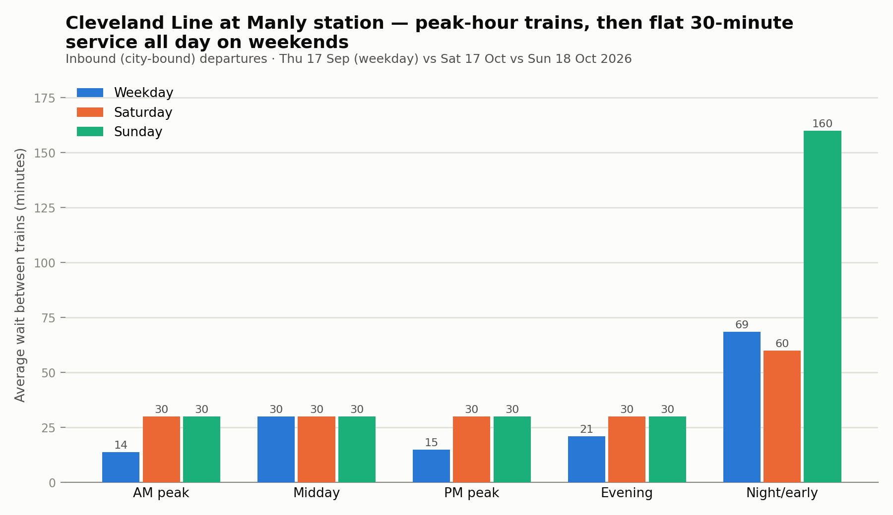

# Case study: the Manly / Lota service gap

Raised as a specific question: a resident of Manly/Lota (bayside, ~13km east of the Brisbane CBD, on the Cleveland rail line) says the transport service there feels poor. This turns that into a measurable claim from the scheduled GTFS timetable — not real-time reliability, just what's actually timetabled.

## Method

Headway (average minutes between departures, estimated as each time-of-day window's length divided by how many scheduled departures fall in it — see note below on why not a raw gap average) at the corridor's **inbound, city-bound** rail platform (Manly station, platform 1 — Lota station matches closely, same line) and its busiest inbound bus stop (Manly Rd at Silky Oaks, routes toward the City/Fortitude Valley), split into five time-of-day windows, on three representative dates chosen the same way as the main network summary (`ingestion/service_calendar.py` — the date, among all dates of that weekday type in the feed, whose total scheduled-trip count is closest to the median):

- Weekday: **Thursday, 17 September 2026**
- Saturday: **Saturday, 17 October 2026**
- Sunday: **Sunday, 18 October 2026**

## Rail: Cleveland Line at Manly station (inbound)

| Time of day | Weekday | Saturday | Sunday |
|---|---|---|---|
| AM peak | every 14 min | every 30 min | every 30 min |
| Midday | every 30 min | every 30 min | every 30 min |
| PM peak | every 15 min | every 30 min | every 30 min |
| Evening | every 21 min | every 30 min | every 30 min |
| Night/early | every 69 min | every 60 min | every 160 min |

Weekday peak service is genuinely good — a train roughly every 15 minutes at AM and PM peak. But there is **no weekend peak at all**: Saturday runs a flat 30-minute service all day, including the hours when someone would be travelling to a Saturday shift or an early appointment. Sunday is a little better in the morning but still 30 minutes for most of the day.

## Bus: Manly Rd corridor (inbound toward the City)

| Time of day | Weekday | Saturday | Sunday |
|---|---|---|---|
| AM peak | every 13 min | every 45 min | every 90 min |
| Midday | every 21 min | every 20 min | every 30 min |
| PM peak | every 21 min | every 19 min | every 30 min |
| Evening | every 105 min | every 210 min | — |
| Night/early | every 240 min | every 480 min | — |

The bus corridor is the more dramatic gap: a bus roughly every 13-21 minutes across the weekday collapses to **every 90 minutes on Sunday mornings**, and to **almost nothing after about 7pm** — every 105 minutes on a weekday evening, once every 4-8 hours overnight, and no scheduled evening or night service at all on Sunday.

## Is this specific to Manly/Lota, or citywide?

Checked against every other Brisbane bus stop with comparable weekday importance (≥30 weekday trips — i.e. stops that matter enough to run frequent weekday service), the Manly Rd corridor's Sunday-morning service sits at the **51st percentile** — almost exactly the citywide median for stops like it.

That's the actual finding worth taking to Council or Translink: **this isn't a Manly/Lota-specific shortfall, it's a citywide pattern** — Brisbane's middle and outer suburbs broadly get a weekday-only frequent-service model, with evenings and Sundays dropping to hourly-or-worse almost everywhere outside the core busway/rail spine. Manly/Lota is a clear, well-documented example of it, not an outlier — which arguably makes it a *more* useful case study, since fixing the underlying weekend-frequency policy would help every suburb in the same position, not just one.

## Caveats

- This measures the **published timetable**, not actual on-the-ground reliability — GTFS static says nothing about delays, cancellations or overcrowding.
- "Manly/Lota" here means stops whose name contains those suburb names, not an official suburb boundary.
- One representative date per day-type, not every date in the feed — chosen to avoid a one-off public/school holiday skewing the picture, but a single day-type calendar shift (e.g. a service change mid-quarter) wouldn't be caught.
- Headway is window-length ÷ departure count, not a mean of consecutive gaps: this stop has several routes overlapping, and two of them scheduled a few minutes apart (then a long gap to the next pair) makes a raw gap-average wildly dependent on which bucket happens to catch the short gap — it can misleadingly read as high-frequency in a bucket with only one or two trips. The window/count estimate is immune to that, at the cost of smoothing over any unevenness within a window.
