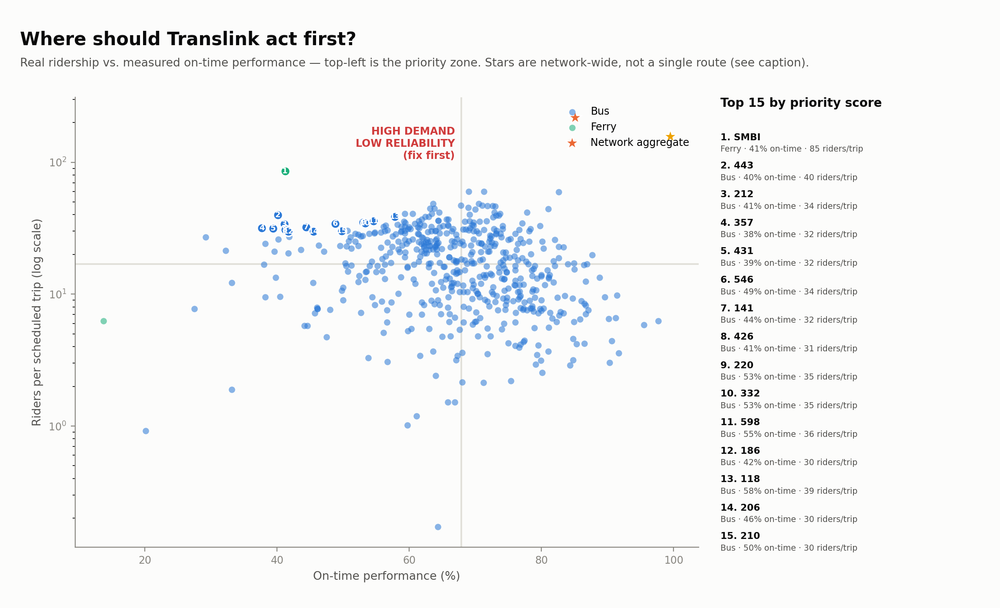

# Priority routes — where demand and unreliability overlap

Every other finding in this repo looks at demand or reliability separately. This combines them: real ridership (Queensland Government OD data, May 2026, June 2026, July 2026) against measured on-time performance (our own polled GTFS-RT data — see `docs/week2_findings.md`). A route that's both heavily used *and* unreliable affects far more riders per late arrival than a quiet route running just as badly — that's the actual case for where to act first, not raw ridership or raw unreliability alone.

`priority_score = demand_percentile × (100 − on_time_percentile)` — both factors matter multiplicatively; a route only extreme on one axis doesn't rank highly for that alone. Scheduled trips on **Thursday, 17 September 2026** (representative weekday, same method as Week 1).

**"Rail (network)" and "Tram/Light Rail (network)" are network-wide aggregates, not single routes.** The OD dataset reports heavy rail and the Gold Coast Light Rail as one system-wide bucket each ("Rail", "GCLR") rather than per individual line the way bus routes get their own number — so unlike every bus/ferry row below, these two represent an entire network's average, not one corridor. Included so both modes are visible at all (a plain per-route join drops them completely — neither OD code matches a GTFS route_short_name), marked with a star on the chart, not ranked as if directly comparable to a single route.

## Top priority routes

| Route | Mode | Avg weekday riders | Riders/trip (percentile) | On-time % (percentile) |
|---|---|---|---|---|
| SMBI (Southern Moreton Bay Island) | Ferry | 5,208 | 85 (100th) | 41% (4th) |
| 443 (Moggil - City Rocket) | Bus | 639 | 40 (95th) | 40% (3rd) |
| 212 (Carindale - City/Valley via Seven Hills) | Bus | 1,121 | 34 (90th) | 41% (3rd) |
| 357 (Brendale - City Express) | Bus | 541 | 32 (87th) | 38% (1st) |
| 431 (Kenmore South - City Rocket) | Bus | 189 | 32 (86th) | 39% (2nd) |
| 546 (Park Ridge - City via Greenbank & Griffith Uni) | Bus | 684 | 34 (90th) | 49% (7th) |
| 141 (Browns Plains - City Rocket) | Bus | 548 | 32 (87th) | 44% (5th) |
| 426 (Kenmore - City Rocket via Chapel Hill) | Bus | 216 | 31 (84th) | 41% (4th) |
| 220 (Wynnum - City Express) | Bus | 1,083 | 35 (91st) | 53% (12th) |
| 332 (Zillmere - City Rocket via Spring Hill) | Bus | 553 | 35 (91st) | 53% (12th) |
| 598 (Great Circle Line Anti-Clockwise) | Bus | 1,965 | 36 (92nd) | 55% (13th) |
| 186 (Wishart - City Rocket) | Bus | 567 | 30 (81st) | 42% (4th) |
| 118 (Forest Lake - City) | Bus | 465 | 39 (94th) | 58% (19th) |
| 206 (Carindale - City Rocket) | Bus | 570 | 30 (81st) | 46% (5th) |
| 210 (Cannon Hill - City/Valley) | Bus | 1,540 | 30 (82nd) | 50% (8th) |

**SMBI (Southern Moreton Bay Island)** tops the list: 5,208 riders/weekday — 100th percentile demand — running on-time only 41% of the time (4th percentile reliability, near the bottom citywide). This is a heavily-used service that's unreliable most of the time it runs, which is a materially bigger problem than either a quiet-but-unreliable route or a busy-but-punctual one.

Route 220 from the Manly/Lota/Cleveland case study (`docs/manly_lota_service_gap.md`) appears in this citywide top list too, independently confirming that case study's finding: it's not just locally notable, it's among the routes Brisbane's whole network most needs to fix.

## Caveats

- Same caveats as the underlying data: ridership is a monthly average against one representative weekday's schedule (`docs/demand_intelligence_findings.md`), and on-time performance reflects the collection window logged in `docs/week2_findings.md` (growing over time as the poller keeps running) — re-run this after a longer collection window for a more stable reliability figure.
- Percentile-based scoring is relative, not absolute: if the *whole* network were reliable, a route at the bottom percentile could still have decent raw on-time performance, and vice versa. Check the raw numbers in the table, not just the rank.
- This ranks routes, not root causes — a route's poor on-time performance could stem from anything (road congestion, dwell time, schedule padding, driver availability); this analysis doesn't diagnose which, only where to look.
