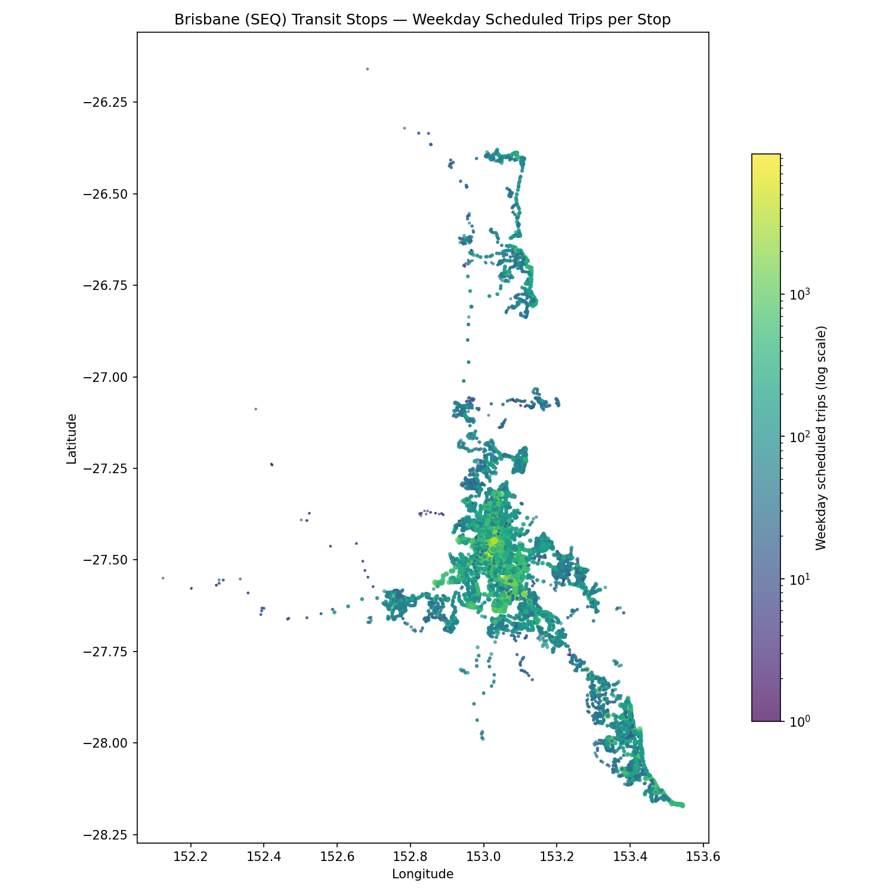

# Week 1 findings — Brisbane transit network overview

- 12,793 stops with at least one weekday-scheduled trip
- 1,174 routes running weekday service
- 92,300 total weekday scheduled trips

## Weekday trips by mode

| Mode | Weekday trips |
|---|---|
| Bus | 88,114 |
| Rail | 3,069 |
| Ferry | 844 |
| Tram/Light Rail | 273 |

## Busiest stops (by weekday scheduled trips)

| Stop | Weekday trips | Routes served |
|---|---|---|
| Cultural Centre station, platform 1 | 9,646 | 82 |
| South Bank busway station, platform 4 | 6,682 | 61 |
| Cultural Centre station, platform 2 | 6,682 | 61 |
| Mater Hill station, platform 2 | 6,682 | 61 |
| Mater Hill station, platform 1 | 6,670 | 61 |
| South Bank busway station, platform 5 | 6,670 | 61 |
| Roma Street busway, platform 1 | 6,022 | 91 |
| Roma Street busway, platform 2 | 6,002 | 86 |
| Woolloongabba station, platform 2 | 5,646 | 60 |
| Woolloongabba station, platform 1 | 5,640 | 60 |
| Griffith University station, platform 1 | 5,316 | 97 |
| Buranda busway, platform 4 | 5,041 | 118 |
| Griffith University station, platform 2 | 4,999 | 97 |
| Buranda busway, platform 3 | 4,710 | 118 |
| Boggo Road station, platform 3 | 4,335 | 41 |

## Biggest interchanges (by distinct routes served)

| Stop | Routes served | Weekday trips |
|---|---|---|
| Buranda busway, platform 4 | 118 | 5,041 |
| Buranda busway, platform 3 | 118 | 4,710 |
| Griffith University station, platform 1 | 97 | 5,316 |
| Griffith University station, platform 2 | 97 | 4,999 |
| Roma Street busway, platform 1 | 91 | 6,022 |
| Roma Street busway, platform 2 | 86 | 6,002 |
| Cultural Centre station, platform 1 | 82 | 9,646 |
| Adelaide Street Stop 28 near Hutton Lane | 78 | 3,916 |
| Upper Mt Gravatt station, platform 1 | 74 | 3,357 |
| Upper Mt Gravatt station, platform 2 | 74 | 3,129 |
| Cultural Centre station, platform 2 | 61 | 6,682 |
| South Bank busway station, platform 4 | 61 | 6,682 |
| South Bank busway station, platform 5 | 61 | 6,670 |
| Mater Hill station, platform 1 | 61 | 6,670 |
| Mater Hill station, platform 2 | 61 | 6,682 |

## Highest-frequency routes

| Route | Mode | Weekday trips |
|---|---|---|
| R772 | Bus | 801 |
| 60 | Bus | 786 |
| 199 | Bus | 705 |
| 412 | Bus | 696 |
| R589 | Bus | 598 |
| R590 | Bus | 590 |
| 130 | Bus | 572 |
| 150 | Bus | 564 |
| R770 | Bus | 549 |
| R773 | Bus | 549 |
| 345 | Bus | 546 |
| 333 | Bus | 534 |
| 60 | Bus | 524 |
| 61 | Bus | 507 |
| 222 | Bus | 498 |

