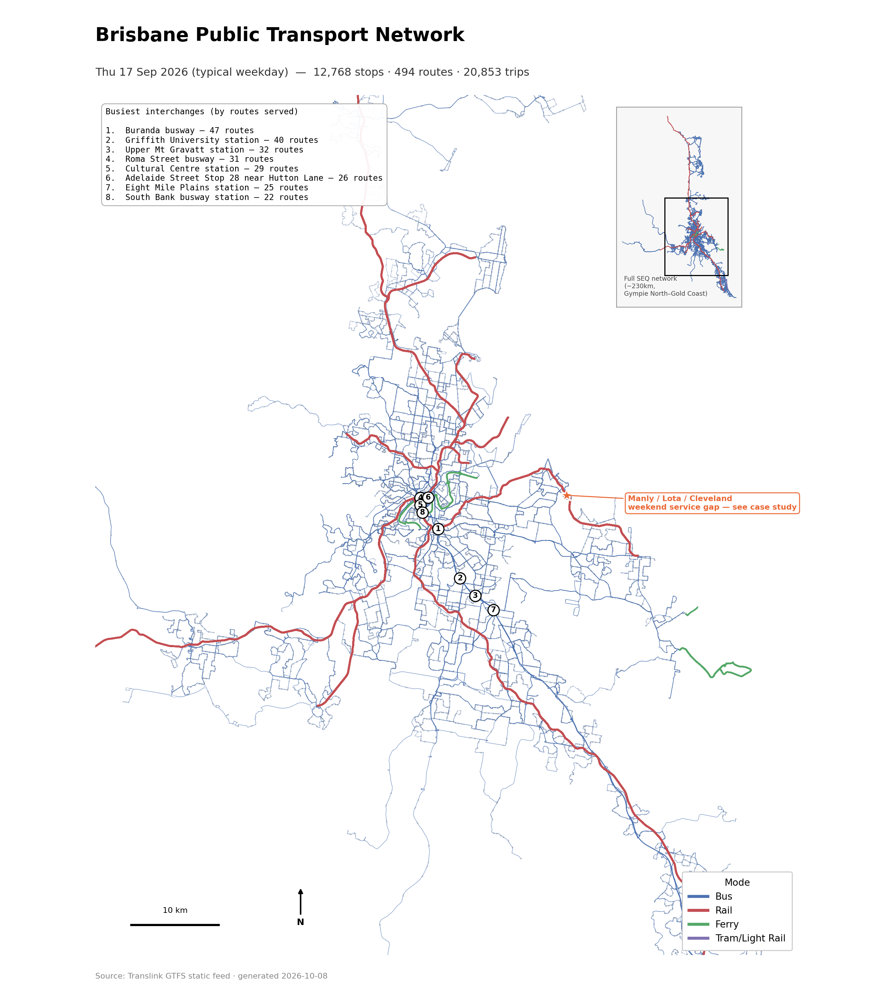

# Week 1 findings — Brisbane transit network overview

Figures reflect scheduled service on **Thursday, 29 October 2026**, picked as a typical weekday (see `ingestion/service_calendar.py`): the date, among all Tuesday/Wednesday/Thursday dates in the feed, whose total scheduled-trip count is closest to the median — not just any date with `calendar.monday = true`, which double-counts wherever the feed republishes a service under overlapping calendar windows (school terms, mid-feed corrections).

- 12,763 stops with at least one scheduled trip that day
- 490 routes running that day
- 20,760 total scheduled trips

## Weekday trips by mode

| Mode | Weekday trips |
|---|---|
| Bus | 18,901 |
| Ferry | 844 |
| Rail | 742 |
| Tram/Light Rail | 273 |

## Busiest stops (by weekday scheduled trips)

| Stop | Weekday trips | Routes served |
|---|---|---|
| Cultural Centre station, platform 1 | 1,932 | 29 |
| Mater Hill station, platform 1 | 1,436 | 22 |
| South Bank busway station, platform 5 | 1,436 | 22 |
| Cultural Centre station, platform 2 | 1,435 | 22 |
| South Bank busway station, platform 4 | 1,435 | 22 |
| Mater Hill station, platform 2 | 1,435 | 22 |
| Roma Street busway, platform 2 | 1,299 | 29 |
| Roma Street busway, platform 1 | 1,147 | 30 |
| Griffith University station, platform 1 | 1,124 | 39 |
| Griffith University station, platform 2 | 1,075 | 39 |
| Buranda busway, platform 4 | 1,058 | 46 |
| Buranda busway, platform 3 | 1,001 | 46 |
| Woolloongabba station, platform 1 | 940 | 20 |
| Woolloongabba station, platform 2 | 939 | 20 |
| Upper Mt Gravatt station, platform 1 | 798 | 32 |

## Biggest interchanges (by distinct routes served)

| Stop | Routes served | Weekday trips |
|---|---|---|
| Buranda busway, platform 4 | 46 | 1,058 |
| Buranda busway, platform 3 | 46 | 1,001 |
| Griffith University station, platform 1 | 39 | 1,124 |
| Griffith University station, platform 2 | 39 | 1,075 |
| Upper Mt Gravatt station, platform 1 | 32 | 798 |
| Upper Mt Gravatt station, platform 2 | 32 | 762 |
| Roma Street busway, platform 1 | 30 | 1,147 |
| Cultural Centre station, platform 1 | 29 | 1,932 |
| Roma Street busway, platform 2 | 29 | 1,299 |
| Adelaide Street Stop 28 near Hutton Lane | 26 | 653 |
| Eight Mile Plains station, platform 1 | 25 | 566 |
| Eight Mile Plains station, platform 2 | 24 | 363 |
| Mater Hill station, platform 2 | 22 | 1,435 |
| Cultural Centre station, platform 2 | 22 | 1,435 |
| South Bank busway station, platform 5 | 22 | 1,436 |

## Highest-frequency routes

| Route | Mode | Weekday trips |
|---|---|---|
| M2 | Bus | 366 |
| M1 | Bus | 364 |
| L1 | Tram/Light Rail | 273 |
| 60 | Bus | 262 |
| 199 | Bus | 235 |
| 412 | Bus | 232 |
| 700 | Bus | 231 |
| 130 | Bus | 186 |
| 150 | Bus | 185 |
| 345 | Bus | 182 |
| 333 | Bus | 178 |
| 61 | Bus | 169 |
| 222 | Bus | 166 |
| 100 | Bus | 163 |
| 196 | Bus | 162 |

*Click the map to read the Manly/Lota/Cleveland service-gap case study — flagged in orange, bayside east/southeast of the CBD.*
