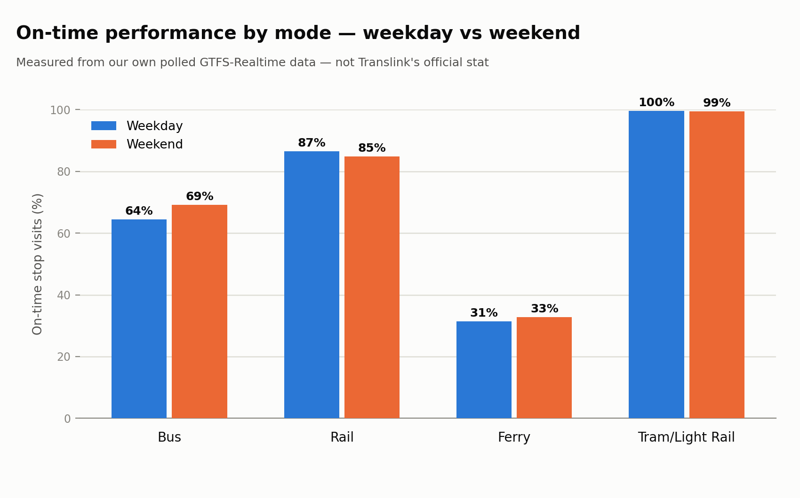

# Week 2 findings — on-time performance & bunching

Collection window: **2026-09-19 05:07 – 2026-09-25 06:31 UTC** (145h 23m, 2,435 polls) — our own measurement from polled GTFS-Realtime data, not Translink's official on-time stat.

"On time" here means arriving no more than 1 minute early and no more than 5 minutes late — a common industry convention. Early running counts against a route because it strands passengers who timed their arrival to the published schedule, not just late running.

## Citywide

- **68.8%** of stop visits on time
- **14.3%** more than 5 minutes late
- **16.9%** more than 1 minute early
- 654,021 stop visits measured

### Weekday vs weekend

A blended figure across the whole collection window hides a real difference — **weekday and weekend service run at different reliability**, and earlier versions of this report were built from weekend-only data without saying so. Split here by the scheduled service's actual calendar day, not by when we happened to be polling:

| | On time | Late | Early | Stop visits |
|---|---|---|---|---|
| Weekday | 67.0% | 12.3% | 20.6% | 326,276 |
| Weekend | 70.5% | 16.3% | 13.2% | 327,745 |

These numbers are close (weekday and weekend within a few points of each other) — that's real, not a bug, and it's worth understanding *why* before concluding weekend service is nearly as good as weekday: on-time performance only measures the trips that run, not how many exist. See `docs/weekend_frequency_gap.md` for the actual weekend gap this number can't show — a real fraction of routes have zero weekend service at all, affecting ~7-10% of weekday ridership.

## Worst on-time performance (routes with ≥30 stop visits across ≥5 distinct trips)

| Route | Mode | On time | Late | Early | Stop visits | Trips |
|---|---|---|---|---|---|---|
| 529 | Bus | 11.9% | 54.2% | 33.9% | 59 | 6 |
| F50 | Ferry | 12.6% | 0.5% | 86.9% | 214 | 119 |
| 50 | Bus | 22.2% | 10.5% | 67.3% | 162 | 19 |
| 142 | Bus | 25.8% | 9.7% | 64.5% | 62 | 12 |
| 116 | Bus | 29.2% | 68.1% | 2.7% | 408 | 7 |
| 263 | Bus | 30.8% | 68.4% | 0.9% | 117 | 5 |
| 223 | Bus | 32.1% | 31.8% | 36.1% | 371 | 7 |
| 182 | Bus | 33.1% | 34.3% | 32.6% | 1,390 | 33 |
| 471 | Bus | 33.2% | 13.7% | 53.1% | 271 | 12 |
| N199 | Bus | 35.5% | 0.0% | 64.5% | 186 | 7 |
| 416 | Bus | 36.2% | 0.0% | 63.8% | 105 | 6 |
| 275 | Bus | 37.3% | 15.5% | 47.2% | 303 | 8 |
| N226 | Bus | 37.7% | 55.5% | 6.8% | 382 | 5 |
| 40 | Bus | 37.8% | 4.1% | 58.2% | 196 | 21 |
| 202 | Bus | 37.9% | 12.5% | 49.6% | 522 | 15 |

## Best on-time performance (routes with ≥30 stop visits across ≥5 distinct trips)

| Route | Mode | On time | Late | Early | Stop visits | Trips |
|---|---|---|---|---|---|---|
| DBBR | Rail | 100.0% | 0.0% | 0.0% | 79 | 8 |
| BRSH | Rail | 100.0% | 0.0% | 0.0% | 98 | 12 |
| SHBR | Rail | 100.0% | 0.0% | 0.0% | 105 | 13 |
| L1 | Tram/Light Rail | 99.4% | 0.4% | 0.2% | 13,010 | 527 |
| BRSH | Rail | 99.4% | 0.0% | 0.6% | 159 | 15 |
| BRRP | Rail | 99.3% | 0.7% | 0.0% | 278 | 14 |
| BRRP | Rail | 98.5% | 0.0% | 1.5% | 200 | 9 |
| SHBR | Rail | 98.4% | 0.0% | 1.6% | 243 | 19 |
| SPRP | Rail | 98.3% | 0.0% | 1.7% | 175 | 5 |
| RPBR | Rail | 98.0% | 0.0% | 2.0% | 299 | 13 |
| SHBR | Rail | 97.5% | 1.9% | 0.5% | 364 | 35 |
| BRIP | Rail | 97.3% | 0.0% | 2.7% | 185 | 10 |
| SPCA | Rail | 97.0% | 0.0% | 3.0% | 169 | 8 |
| BRIP | Rail | 96.6% | 0.0% | 3.4% | 326 | 12 |
| SPCA | Rail | 96.4% | 0.0% | 3.6% | 197 | 8 |

## Bunching (two vehicles on the same route within 400m, same poll)

| Route | Bunching snapshots | Distinct polls bunched | First seen | Last seen |
|---|---|---|---|---|
| SHBR | 6,198 | 620 | 22:37 | 13:21 |
| 199 | 4,432 | 1,110 | 20:01 | 06:30 |
| M1 | 4,388 | 1,651 | 05:07 | 06:30 |
| BDBR | 3,819 | 428 | 02:29 | 13:21 |
| 60 | 3,808 | 1,017 | 20:01 | 06:30 |
| 700 | 3,268 | 1,428 | 05:07 | 06:30 |
| 705 | 3,054 | 1,406 | 05:09 | 06:30 |
| M2 | 2,854 | 1,185 | 05:07 | 06:30 |
| 61 | 2,423 | 1,131 | 20:01 | 06:30 |
| 100 | 1,875 | 877 | 20:25 | 06:30 |
| 196 | 1,864 | 1,013 | 20:18 | 06:30 |
| 340 | 1,816 | 976 | 20:27 | 06:30 |
| 333 | 1,775 | 975 | 20:25 | 06:30 |
| 555 | 1,712 | 836 | 05:09 | 06:30 |
| 412 | 1,701 | 805 | 20:21 | 06:30 |

## Method & caveats

- **Delay is the last GTFS-RT prediction polled for a stop, not a confirmed arrival event.** Trip Updates carry predictions that sharpen as a vehicle approaches a stop; we take the last one polled before the vehicle presumably passed as the closest proxy to what happened, without cross-referencing vehicle positions stop-by-stop.
- **Bunching is a same-poll, 400m proximity heuristic**, not a same-route-position check — two vehicles happening to be near each other at a shared terminus or layover point can register as "bunched" without actually being back-to-back on route. Treat the ranking as directional, not exact.
- Route rankings only include routes with ≥30 stop visits **across ≥5 distinct trips**. Stop visits alone aren't enough: a low-frequency route can rack up dozens of stop visits from a single catastrophically delayed trip cascading down its stop sequence, making one bad run look like a systemically unreliable route. Requiring several independent trips guards against that.
- A short collection window skews toward whatever was running when it was collected (e.g. all-peak, or all-overnight) — check the collection window above before treating a route's number as representative of its typical performance.
- The route-level Worst/Best tables and the bunching table below are **blended across weekday and weekend** (splitting them further would thin out the per-route trip counts below the reliability threshold for most routes). Only the citywide/mode figures above are split by day type.
